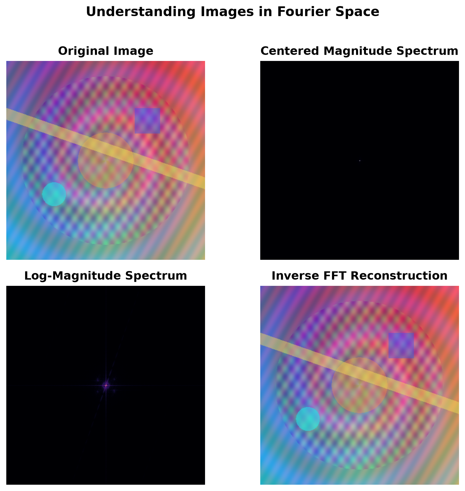
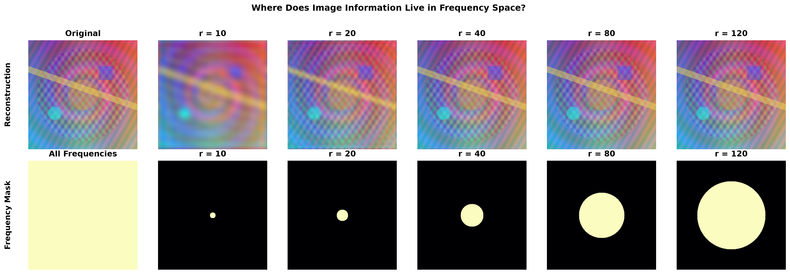

# Spectral Diffusion Playground

Research-quality visual experiments for building Fourier intuition around
diffusion denoising and memorization.



## Status

Experiments 1–3 are complete and form the reusable Fourier foundation.
Experiments 4–6 are being redesigned around a **paper-derived clean-room
reimplementation** of experiments from *Two Calm Ends and the Wild Middle: A
Geometric Picture of Memorization in Diffusion Models*.

The original executed paper code for the fixed-sigma MSE curves, whole-denoiser
swaps, and nearest-neighbor memorization evaluator was unavailable. Future work
will therefore be derived from the paper and documented assumptions. It will
not be described as code-identical or an exact numerical reproduction.

Experiment 4 is finalized with a single-reviewer qualitative visual decision:
the reference cutoff is `r_star = 4`, the primary E005 sensitivity cutoffs are
`r = 3` and `r = 5`, and `r = 6` is an optional extended sensitivity check.
The originally planned two-independent-reviewer scoring procedure was not
completed, so this is not an inter-rater or blinded review result. Both reviewer
CSV templates remain blank. No Experiment 5–6 results currently exist in this
repository.

## Motivation

Diffusion models are usually introduced in pixel space: add Gaussian noise,
predict a clean target or noise, and integrate a denoising trajectory. Fourier
analysis adds a complementary view by separating spatial variation according
to frequency.

That view is useful for asking precise questions:

- How does an image change when represented in frequency space?
- How does additive Gaussian noise redistribute spectral energy?
- Which image components remain when only a bounded frequency region is kept?
- Can denoising residual energy be decomposed into auditable, complementary
  frequency bands?

Frequency bands are operational measurements, not semantic categories. Low
frequency is not assumed to equal understanding, and high frequency is not
assumed to equal memorization.

## Design Principles

- One experiment answers one narrow question.
- Every experiment runs independently from the repository root.
- Shared numerical and plotting logic lives in
  `src/spectral_diffusion_playground/`.
- Computation is separated from display normalization.
- Raw measurements must precede scientific interpretation.
- Paper-derived clean-room work must document assumptions and discrepancies.

## Completed Fourier Foundations

### Understanding Images in Fourier Space

`experiments/01_fft_visualization.py` demonstrates the reversible path from
pixel space to a centered Fourier representation and back:

- original image;
- centered magnitude spectrum;
- log-magnitude spectrum;
- inverse FFT reconstruction.

The FFT is applied independently over the spatial dimensions of each channel
with orthonormal normalization.

```bash
python experiments/01_fft_visualization.py
python experiments/01_fft_visualization.py --grayscale
python experiments/01_fft_visualization.py \
    --image-path assets/examples/natural/image_005.jpg
```

### How Gaussian Noise Changes Frequency Content

`experiments/02_noise_vs_frequency.py` evaluates

```text
x_sigma = x + sigma * epsilon,    epsilon ~ N(0, I)
```

for `sigma in {0, 0.05, 0.1, 0.2, 0.5}`. It compares noisy images, log Fourier
spectra, radial energy profiles, and normalized radial spectral distributions.
Noise generation is deterministic for a fixed seed.


```bash
python experiments/02_noise_vs_frequency.py
python experiments/02_noise_vs_frequency.py \
    --image-path assets/examples/natural/image_002.jpg
```

### Where Does Image Information Live in Frequency Space?

`experiments/03_frequency_decomposition.py` applies nested circular low-pass
masks and visualizes:

- the retained frequency region;
- the low-pass reconstruction;
- the complementary signed residual;
- relative reconstruction error versus radius.

The low- and high-frequency masks are exactly complementary. With the
orthonormal FFT, their spatial reconstructions sum to the input up to numerical
precision.



```bash
python experiments/03_frequency_decomposition.py
python experiments/03_frequency_decomposition.py \
    --image-path assets/examples/natural/image_005.jpg \
    --radii 10 20 40 80 120
```

## Redesign Roadmap

Experiment 4 is implemented and finalized under the disclosed qualitative
decision process. Experiments 5–6 remain specifications only until separately
reviewed and implemented.

| Experiment | Planned question | Current status |
| --- | --- | --- |
| E004: Operational CIFAR-10 cutoff | Which centered radial cutoff provides a useful, explicitly operational split on 32 x 32 CIFAR-10 images? | Finalized by [single-reviewer qualitative visual decision](docs/experiment_04_frequency_cutoff_decision.md): `r_star = 4`; primary sensitivity at `r = 3, 5`; optional extended check at `r = 6` |
| E005: Orthogonal residual-energy curves | How does the paper's fixed-sigma Eq. (5) residual energy divide into complementary low- and high-frequency components? | [Clean-room protocol frozen](docs/experiment_05_spectral_residual_protocol.md); execution blocked on checkpoint and 1K-subset provenance; no results |
| E006: Whole-denoiser transition-window swaps | Do whole-denoiser swaps around the E005 transition windows alter trajectory-level memorization under the clean-room setup? | Redesign pending; no results |

For E005, the intended mathematical object is the denoising residual

```text
e_sigma = m_sigma(X + sigma Z) - X
```

with orthogonal projections applied directly to `e_sigma`. The resulting
low- and high-band squared energies must sum to the full residual energy within
numerical tolerance. This is different from the superseded clipped
relative-error recovery-score program.

E006 will swap the entire denoiser selected at a sampling step. Frequency
components of denoiser outputs will not be spliced in the primary experiment.
The paper's inconsistent swap-boundary descriptions must be handled as an
explicit clean-room design decision, not silently resolved.

Generate the complete E004 packet from an existing torchvision-compatible
CIFAR-10 root:

```bash
python experiments/04_frequency_cutoff.py \
    --dataset-root /path/to/cifar10
```

This writes deterministic manifests and measurements, five class-grouped
montages, and blank independent reviewer templates. It does not score images or
select a cutoff. The cutoff was subsequently frozen through a disclosed
single-reviewer qualitative visual decision rather than the originally planned
two-reviewer scoring procedure. See the
[frozen protocol](docs/experiment_04_frequency_cutoff_protocol.md) and
[final decision record](docs/experiment_04_frequency_cutoff_decision.md).

## Installation

Python 3.11 or newer is required.

```bash
python3.11 -m venv .venv
source .venv/bin/activate
pip install --upgrade pip
pip install -r requirements.txt
pip install -e .
```

## Repository Layout

```text
spectral-diffusion-playground/
├── assets/
│   ├── default_fft_reference.png
│   └── examples/
├── docs/
├── experiments/
│   ├── 01_fft_visualization.py
│   ├── 02_noise_vs_frequency.py
│   ├── 03_frequency_decomposition.py
│   └── 04_frequency_cutoff.py
├── figures/
├── results/
├── src/
│   └── spectral_diffusion_playground/
│       ├── fft.py
│       ├── filters.py
│       ├── frequency_cutoff.py
│       ├── noise.py
│       ├── utils.py
│       └── visualization.py
└── tests/
```

## Reproducibility

Run the full test suite with:

```bash
python -m unittest discover tests
```

The tests cover FFT round trips, centered-mask geometry, low/high-frequency
complementarity, deterministic noise, shared image utilities, E004 numerical
identities, output schemas, blank reviewer templates, and synthetic cutoff
selection cases.

## Citation

If this repository is used in research, cite it as software and include the
exact Git commit used for the reported result. Future paper-derived clean-room
experiments should also cite the grounding paper and disclose that the original
executed implementation was unavailable.

## License

Released under the MIT License. See [LICENSE](LICENSE).
