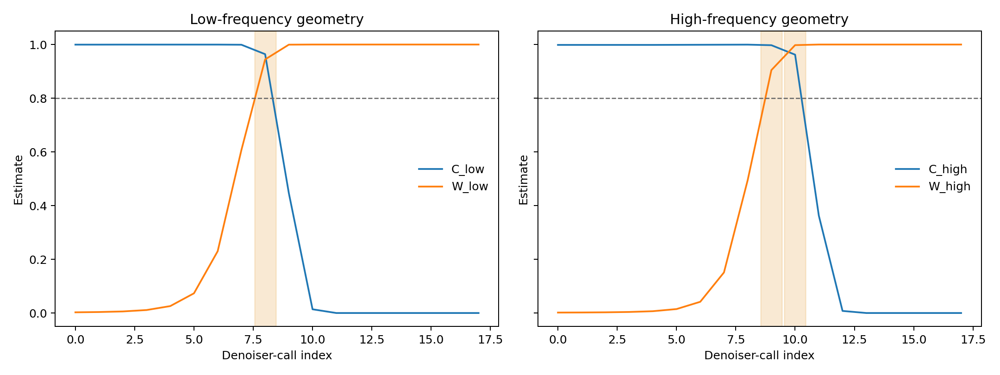
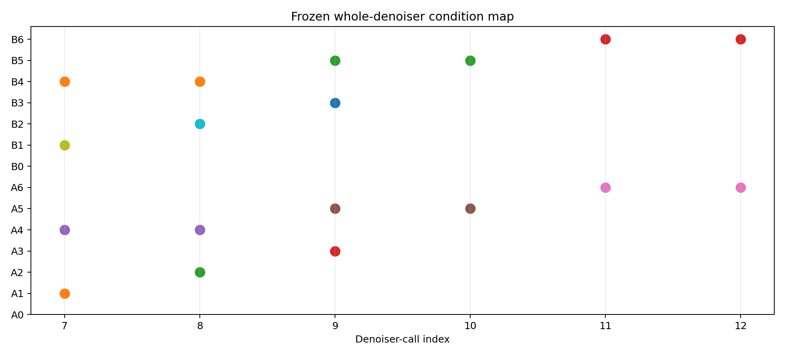
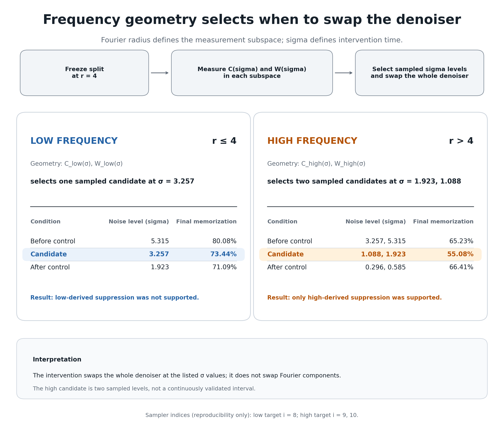

# Spectral Diffusion Playground

[](https://www.python.org/)
[](#installation-and-reproduction)
[](LICENSE)
[](https://github.com/xinyugao233/spectral-diffusion-playground/tree/portfolio-v1)

A research portfolio using frequency-resolved data geometry to ask **when
along a diffusion trajectory an intervention can change memorization**.

## Research Question

> Can frequency-resolved geometry identify trajectory times where a
> whole-denoiser intervention selectively changes memorization?

A sampler passes through many denoising steps on its way from noise to an
image. Memorization need not be equally sensitive at every step. This project
first freezes an operational Fourier decomposition, uses geometry in each
subspace to choose candidate times, and then tests those times against
neighboring controls.

The analysis is a paper-derived clean-room extension of
[*Two Calm Ends and the Wild Middle: A Geometric Picture of Memorization in
Diffusion Models*](https://arxiv.org/abs/2602.17846). It does not claim exact
reproduction of the paper's unavailable executed code.

## The Idea

1. Freeze a low/high Fourier split at `r = 4`.
2. Measure coverage and posterior concentration independently in each
   subspace.
3. Select a low-derived candidate at `sigma = 3.2568` and a high-derived
   candidate at the sampled levels `sigma = 1.9233, 1.0882`.
4. Temporarily replace the whole denoiser while the sampler is at those noise
   levels.
5. Compare each target with its preregistered neighboring controls.

```text
Fourier decomposition
        -> E004: freeze r = 4
        -> E004B: low/high coverage and posterior geometry
        -> low candidate sigma = 3.2568
        -> high candidate sigma = 1.9233, 1.0882
        -> E010: whole-denoiser swaps
        -> high-derived suppression supported
```

> **Frequency is used as a lens for choosing when along the diffusion
> trajectory to intervene. The intervention swaps the whole denoiser, not
> individual Fourier components.**

Two coordinates must remain distinct:

- **Fourier radius `r`** defines which spatial frequencies belong to the low
  and high subspaces. The center contains slowly varying structure; moving
  outward progressively adds edges, textures, and finer variation.
- **Diffusion noise level `sigma` / sampler index** locates a point along the
  denoising trajectory.

The radius is frozen first; geometry is then measured as `sigma` changes.
E004 uses `r = 4`, with sensitivity checks at `r = 3,5`. This is an
operational CIFAR-10 split, not a universal semantic boundary.
Fourier radius has no diffusion-time meaning, and `sigma` does not choose which
Fourier coefficients belong to either band.

## 1. From Coarse To Fine Frequencies

The foundation is intentionally simple. E001 shows that the Fourier transform
reorganizes image variation without discarding it. E002 shows that Gaussian
noise contributes broadly across frequencies. E003 performs a **radial
frequency sweep**: small centered radii retain broad, slowly varying image
structure, while increasing the radius restores progressively finer
variation. E004 then freezes the operational split before model results are
examined.


The low-pass reconstruction and its exact complementary high-pass residual sum
back to the original image. These are measurement subspaces, not semantic
labels.

## 2. Geometry Selects Candidate Sigma Locations

The paper's geometry contributes two complementary measurements:

- **Coverage `C_sigma`:** how much noisy held-out data lies inside regions
  covered by training-centered Gaussian shells.
- **Maximum posterior weight `W_sigma`:** how strongly the empirical posterior
  concentrates on a single training example.

High coverage together with high posterior concentration defines a clean-room
candidate regime where noisy data broadly overlaps the training geometry while
individual training examples remain distinguishable. This is an operational
diagnostic, not a universal theoretical boundary.

Once `r` is frozen, E004B computes the same two quantities independently in
the complementary Fourier subspaces:

```text
low-frequency geometry:   C_low(sigma),  W_low(sigma)
high-frequency geometry:  C_high(sigma), W_high(sigma)
```



On the frozen 18-point schedule, the conservative rule selects a sampled noise
level only when the 95% lower confidence bounds for both quantities reach
`0.8`:

```text
D_b^grid = {sigma_i : LCB(C_b(sigma_i)) >= 0.8
                       and LCB(W_b(sigma_i)) >= 0.8}
```

| Geometry source | Candidate sigma location(s) | Sampler calls |
| --- | --- | --- |
| Low-frequency subspace | `3.2568` | `{8}` |
| High-frequency subspace | `1.9233, 1.0882` | `{9,10}` |

The low candidate is one point on the sampled grid, not a resolved continuous
zone. The high candidate contains two sampled sigma values; writing the visual
span as approximately `1.09-1.92` must not imply that unmeasured values between
them passed the rule.

These locations were selected from frequency-restricted geometry **before
looking at the E010 swap outcomes**. The two subspaces enter their joint
high-coverage, high-concentration regimes at different sampled points along the
trajectory. However, their real projector ranks differ sharply at `r = 4`
(`d_low = 147`, `d_high = 2925`), so frequency is confounded with dimension,
covariance, and power structure.

That bridge motivates the experiment: if the geometry-derived intervals are
unusually influential, intervention at a target should matter more than
intervention immediately before or after it.

## 3. Intervening At Those Sigma Locations

E010 uses a whole-denoiser swap at frequency-derived sigma locations:

```text
recipient model runs normally
        -> sigma enters the frozen sampled candidate
        -> donor replaces the whole denoiser
        -> donor remains active at every listed sigma value
        -> recipient resumes immediately afterward
        -> final sample is evaluated for memorization
```

The two directional questions are:

- **Suppression:** memorizing recipient + empirically generalizing,
  floor-baseline donor. Can the donor suppress memorization?
- **Induction:** empirically generalizing recipient + memorizing donor. Can the
  donor induce memorization?

Each target is compared with its preregistered neighboring controls. The
intervention replaces the entire denoiser only at the listed sigma values; it
never swaps `sigma`, Fourier coefficients, or isolated Fourier components.
Sampler-call indices are the exact implementation mapping for those values.



## 4. Main Result

> **Swapping the whole denoiser at the high-frequency-derived sampled sigma
> values `1.9233` and `1.0882` suppressed memorization more strongly than both
> neighboring width-matched controls.**

```text
memorizing no-swap baseline:               215/256 = 83.98%
generalizing no-swap baseline:               0/256 observed memorized samples

high target final memorization rate:       141/256 = 55.08%
neighboring final memorization rates:      167/256 = 65.23%
                                          170/256 = 66.41%

high target suppression effect:                       28.91%
neighboring suppression effects:            18.75%, 17.58%
target effect - mean(control effects):                 10.74%
paired bootstrap 95% CI:                      [6.84%, 14.84%]
```



[PDF version](figures/experiment_10/low_high_directional_swap_table.pdf)


**What we found**

1. Low- and high-frequency geometry selected different denoising times.
2. The frozen low candidate was `sigma=3.2568`; the high candidate was the
   sampled set `sigma={1.9233,1.0882}`. Their exact implementation calls were
   `{8}` and `{9,10}`.
3. Only high-derived suppression passed the preregistered influence criterion:
   **`HIGH_DERIVED_SUPPRESSION_SUPPORTED`**.
4. Low-derived suppression was not supported. Induction was not supported and
   was floor-limited by the EDM-50K recipient: no memorized samples were
   observed for its `0/256` no-swap baseline under the frozen E010 seeds.

At the low-derived candidate `sigma = 3.2568`, the final memorization rate was
`188/256 = 73.44%`; the later neighboring control was lower at
`182/256 = 71.09%`. The low location therefore was not selectively special
under the frozen criterion. At the high-derived sampled locations, the final
rate was `141/256 = 55.08%`, below both controls at `65.23%` and `66.41%`.

The strongest evidence is not merely a lower target rate; it is that the
suppression effect exceeded both neighboring controls and its paired confidence
interval excluded zero.

In one sentence: the project freezes an operational Fourier split, measures
low- and high-subspace coverage and posterior concentration as `sigma` changes,
uses their joint high-high sampled locations to choose when to swap the whole
denoiser, and finds selective memorization suppression only at the
high-derived candidate for the tested model pair.

### Scope Of The Result

E010 establishes a selective timing association for one asymmetric model pair
under a whole-denoiser intervention. It does **not** establish:

- high-frequency-component or fine-detail causality;
- dataset-size causality;
- a universal memorization danger zone;
- a continuous danger interval between sparsely sampled sigma values;
- a general impossibility of induction; or
- generalization beyond the tested pair, sampler, seeds, and memorization
  criterion.

Frequency-resolved geometry determines **when** the whole denoiser is swapped;
frequency is not itself the manipulated model component. The strongest
supported claim is that the high-frequency-geometry-derived sampled set is
selectively influential for suppression under this intervention and tested
model pair.

## Start Here

- [Main E010 result and full validation](docs/experiment_10_directional_memorization_transfer_results.md)
- [Frequency-resolved geometry](#e004b-when-do-low-and-high-geometry-become-distinctive)
- [Supporting and historical experiments](#supporting-and-historical-experiments)
- [Full documentation and results](#documentation-and-results)

## E001: From Pixels To Frequency Space

**Question.** What information does a channelwise 2D Fourier transform expose,
and can the original image be recovered? E001 computes the centered FFT,
linear and log-magnitude spectra, and inverse FFT with orthonormal
normalization. The reconstruction matches the input up to numerical precision.


- **Purpose:** Build intuition for the reversible pixel-space to frequency-space
  transformation.
- **Main artifact:** [RGB FFT visualization](figures/understanding_images_in_fourier_space_default_fft_reference_rgb.png)
  and [RGB/grayscale comparison](figures/understanding_images_in_fourier_space_default_fft_reference_rgb_and_grayscale.png).
- **Takeaway:** Fourier space reorganizes image variation by spatial frequency;
  it does not discard information by itself.

```bash
python experiments/01_fft_visualization.py
python experiments/01_fft_visualization.py --grayscale
```

## E002: How Gaussian Noise Changes Frequency Content

**Question.** How does additive white Gaussian noise alter an image and its
spectrum? E002 evaluates five frozen noise levels and compares pixel-space
corruption with log spectra and radial energy distributions. Increasing noise
raises energy broadly across spatial frequencies and makes the normalized
DC-excluded profile more uniform.


- **Purpose:** Connect pixel-space corruption to frequency-space behavior.
- **Main artifact:** [Noise/frequency grid](figures/how_gaussian_noise_changes_frequency_content_default_fft_reference_seed0_grid.png)
  and [normalized radial distribution](figures/how_gaussian_noise_changes_frequency_content_default_fft_reference_seed0_normalized_radial_distribution.png).
- **Takeaway:** White noise contributes broadly rather than occupying one
  narrow frequency band.

```bash
python experiments/02_noise_vs_frequency.py
```

## E003: From Coarse Structure To Fine Variation

**Question.** What becomes visible as progressively larger centered frequency
regions are retained? E003 applies nested circular low-pass masks and exact
complementary high-pass masks. The low-pass reconstruction and signed residual
sum back to the input, while the reconstruction-error curve quantifies how
rapidly image content is recovered.


- **Purpose:** Establish the complementary projection operators used later.
- **Main artifact:** [Reconstruction grid](figures/where_image_information_lives_grid.png),
  [high-frequency residuals](figures/high_frequency_residuals.png), and
  [error curve](figures/reconstruction_error_vs_frequency_radius.png).
- **Takeaway:** Increasing radius progressively restores image variation, but
  frequency bands remain operational measurements rather than semantic labels.

```bash
python experiments/03_frequency_decomposition.py
```

## E004: Freezing An Operational Frequency Split

**Question.** Which centered radial cutoff provides a useful and auditable split
on 32 x 32 CIFAR-10 images? E004 freezes 20 examples, six candidate radii, exact
display conventions, and reconstruction/energy diagnostics before review. A
single disclosed reviewer selected `r = 4` as the smallest visually acceptable
cutoff; `r = 3` and `r = 5` remain the primary sensitivity cutoffs.


- **Purpose:** Freeze an operational frequency split before examining denoiser
  curves.
- **Main artifact:** [Five class-grouped cutoff montages](figures/README.md#e004-operational-frequency-cutoff)
  and the [decision record](docs/experiment_04_frequency_cutoff_decision.md).
- **Takeaway:** `r = 4` is a documented experimental choice, not a universal
  boundary between structure and detail.

The originally planned two-independent-reviewer scoring procedure was not
completed. No inter-rater or blinded-review claim is made.

## E004A: Full-Space Coverage And Posterior Concentration

The paper's geometric picture is defined by two quantities that are distinct
from the repository's Fourier residual energies.

For training set `D = {x_i}`, paper Eq. (3) assigns empirical-posterior weight

```text
w_i(y,sigma) = exp(-||y-x_i||^2 / (2 sigma^2))
               / sum_j exp(-||y-x_j||^2 / (2 sigma^2)).
```

Definition 4.1 averages the largest weight for noisy **training** queries:

```text
W_sigma(D) = E_{X ~ p_D, Z} max_i w_i(X + sigma Z, sigma).
```

Definition 4.6 measures whether a noisy **held-out** query lies in the union of
training-centered Gaussian shells:

```text
C_sigma(p,D) = P(X + sigma Z in union_i S_sigma(x_i)),  X ~ p.
```

Here `p` is the data distribution, not a scalar shell-probability parameter.
The shell radii use the paper's `c = 5` convention and include both annulus
boundaries. Coverage is an exact binary union-of-annuli event; it is not a
nearest-neighbor-distance substitute.


The relationship motivates three qualitative regimes:

- **Small noise:** posterior concentration is high, but held-out shell coverage
  is limited.
- **Medium noise:** coverage and posterior concentration can be simultaneously
  high, producing a clean-room candidate geometric region under the explicit
  thresholds `q_C = q_W = 0.8`.
- **Large noise:** coverage is broad, but posterior concentration is weak.

The paper does not provide a universal numerical boundary for these regimes.
The clean-room protocol froze exploratory thresholds `q_W = q_C = 0.8` before
execution; sampled full-space point estimates are high-high at
`sigma in {2,3,4,5}`. Continuous shading from `2` to `5` is visual only, and
decisions use observed grid points without interpolation.

Evaluating the same definitions directly on the exact 18-point E006 sampler
grid selects indices `{8,9}`, at `sigma in {3.2568215, 1.9233398}`, under both
the point-estimate and 95% lower-bound rules. This is the **E004A clean-room
geometric high-high region** at `q_C=q_W=0.8`, not a universal paper boundary.


This is a **paper-derived clean-room reproduction**, not an exact numerical
reproduction. It uses the first 1,000 canonical CIFAR-10 training and test
images, seed `0`, and a frozen 20-point sigma grid because the paper's exact
subset, seeds, grid, and executed Figure 3 code were unavailable. See the
[source audit](docs/paper_geometry_source_audit.md), [frozen protocol](docs/experiment_04a_paper_geometry_protocol.md),
and [result record](docs/experiment_04a_paper_geometry_results.md).

The committed estimates can also be regenerated end to end from a local
CIFAR-10 archive using the frozen configuration:

```bash
python experiments/04a_paper_geometry_curves.py \
  --compute \
  --dataset-root /path/to/cifar10 \
  --output-dir results/experiment_04a_reproduction \
  --device auto
```

This mode computes both curves from images and deterministic Gaussian draws;
it does not use committed estimates as numerical inputs. `--plot-only` retains
the lightweight figure-regeneration path, and `--validate-only` checks an
existing result directory without recomputation.

The recorded end-to-end CPU run completed in 3.31 seconds with 441.8 MiB peak
resident memory. Every sigma passed the tolerance frozen before execution;
maximum absolute differences were `1.11e-16` for coverage and `4.72e-16` for
maximum posterior weight. The sampled high-high set remained `{2,3,4,5}`.
See the [fresh reproduction artifacts](results/experiment_04a_reproduction/)
and [comparison record](results/experiment_04a_reproduction/reproduction_comparison.csv).

This is an end-to-end local regeneration under the frozen clean-room
configuration. It is independent of the committed curve estimates, but uses
the same subset, seed, sigma grid, estimator, normalization, and Gaussian
draws. The near-exact agreement establishes deterministic reproducibility, not
robustness across alternative subsets or seeds.

## E004B: When Do Low And High Geometry Become Distinctive?

**Question.** Does the paper-derived coverage/concentration geometry occupy
the frozen low- and high-frequency subspaces at the same noise levels? E004B
uses the same CIFAR-10 examples, 18-point schedule, Gaussian corruptions, and
definitions as E004A, then computes both quantities after exact complementary
Fourier projection.

E004B draws two curves in the low-frequency subspace and two curves in the
high-frequency subspace: coverage and maximum posterior weight in each space:

```text
C_low_sigma(p,D)
W_low_sigma(D)
C_high_sigma(p,D)
W_high_sigma(D)
```

This distinction is structural:

```text
E004B = frequency-restricted data geometry
E005  = frequency-restricted denoising residual energy
```


At the primary cutoff `r=4`, the exact real subspace ranks are 147 (low) and
2,925 (high). Applying the frozen `q_C=q_W=0.8` lower-confidence-bound rule
selects the low-band candidate at `sigma=3.2568215` and the high-band candidate
at sampled values `sigma={1.9233398,1.0881706}`. For exact implementation and
reproduction, these map to sampler calls `{8}` and `{9,10}`, respectively.
Point-estimate classification agrees at the primary cutoff.

**Candidate-region interpretation:** at `r=4`, the joint low-band candidate is
the single sampled location `sigma=3.2568`; the joint high-band candidate is
the two-point set `sigma={1.9233,1.0882}`. These are descriptive sampled-grid
objects, not interpolated continuous zones. The large rank difference between
the subspaces prevents attributing their ordering to frequency organization
alone.

At `r=4`, the low- and high-frequency projectors have substantially different
ranks, `147` and `2925`. E004B therefore measures the geometry of the actual
operational Fourier decomposition, but it does not isolate frequency
organization from subspace dimension, covariance, or energy structure.
Rank- and power-matched control subspaces would be required before attributing
the observed ordering specifically to frequency.

The low-band joint high-coverage/high-posterior target occurs one sampler
index earlier than the high-band target. This statement concerns the joint
high-high regions. Coverage alone does not exhibit the same ordering: the
high-band coverage threshold persists to lower sigma, while low-band posterior
concentration persists farther toward high noise.

The low target is unchanged at `r=3,4,5`. The high target is `{9,10}` at
`r=3,4`, while its lower-bound sensitivity result narrows to `{10}` at `r=5`.
This dependence remains visible and does not revise `r=4`.

- **Purpose:** Extend the paper geometry into preregistered complementary
  frequency subspaces without using denoiser outputs.
- **Main artifact:** [Band comparison](figures/experiment_04b/low_high_geometry_comparison.png),
  [cutoff sensitivity](figures/experiment_04b/frequency_geometry_cutoff_sensitivity.png),
  and [validated results](docs/experiment_04b_frequency_restricted_geometry_results.md).
- **Takeaway:** Under the frozen clean-room setup, the low-band candidate is
  `sigma=3.2568`, while the high-band candidate is the next two sampled
  lower-noise values `sigma={1.9233,1.0882}`. This is descriptive geometry,
  not causal or memorization evidence.

```bash
python experiments/04b_frequency_restricted_geometry.py \
  --compute \
  --dataset-root /path/to/cifar10 \
  --output-dir results/experiment_04b_reproduction \
  --figure-dir figures/experiment_04b_reproduction \
  --device cpu \
  --cutoffs 3 4 5
```

## Supporting And Historical Experiments

The main result can be understood through the E001-E004 Fourier foundations,
the E004B frequency-resolved geometry, and the E010 intervention. E005-E009
are retained for scientific provenance but are not prerequisites for that
story.

- **E005** provides an optional coarse-to-fine residual-dynamics diagnostic.
- **E006** was formally `INCONCLUSIVE` and did not identify a
  memorization danger zone.
- **E007-E009** document blocked, retired, or negative paths that motivated the
  final directional E010 design.

Their protocols, outcomes, figures, and exact provenance remain available in
the [documentation and results index](#documentation-and-results) and the
[documentation directory](docs/README.md).

## Mathematical Core

The paper geometry first measures full-space coverage and concentration:

```text
C_sigma(p,D) = P(X + sigma Z in union_i S_sigma(x_i))
W_sigma(D)   = E max_i w_i(X + sigma Z, sigma)
```

E004B evaluates the same definitions on projected data and projected Gaussian
corruptions. Its shell dimensions are the exact real projector ranks:

```text
C_sigma^b(p,D), W_sigma^b(D),  b in {low, high}
d_low(r=4) = 147, d_high(r=4) = 2925
```

E005 then asks a different question by applying complementary Fourier
projections to a fixed denoiser's residual.

E005 applies complementary Fourier projections directly to

```text
e_sigma = m_sigma(X + sigma Z) - X
```

and measures

```text
E_full = ||e_sigma||_2^2
E_low  = ||P_low,r e_sigma||_2^2
E_high = ||P_high,r e_sigma||_2^2
```

The channelwise 2D FFT uses `norm="ortho"`; the high-frequency mask is the exact
complement of the centered low-frequency mask. The resulting band energies sum
to the full residual energy within the frozen tolerance.

## Documentation And Results

| Experiment | Protocol and result narrative | Compact results | Figures |
| --- | --- | --- | --- |
| E004 | [Protocol](docs/experiment_04_frequency_cutoff_protocol.md) · [Reviewer instructions](docs/experiment_04_reviewer_instructions.md) · [Decision](docs/experiment_04_frequency_cutoff_decision.md) | [Results index](results/README.md#e004-operational-frequency-cutoff) | [Montages](figures/README.md#e004-operational-frequency-cutoff) |
| E004A | [Source audit](docs/paper_geometry_source_audit.md) · [Protocol](docs/experiment_04a_paper_geometry_protocol.md) · [Results](docs/experiment_04a_paper_geometry_results.md) | [`results/experiment_04a/`](results/experiment_04a/) | [`figures/experiment_04a/`](figures/experiment_04a/) |
| E004B | [Protocol](docs/experiment_04b_frequency_restricted_geometry_protocol.md) · [Results](docs/experiment_04b_frequency_restricted_geometry_results.md) | [`results/experiment_04b/`](results/experiment_04b/) | [`figures/experiment_04b/`](figures/experiment_04b/) |
| E005 | [Protocol](docs/experiment_05_spectral_residual_protocol.md) · [Model provenance](docs/experiment_05_clean_room_models.md) · [Results](docs/experiment_05_spectral_residual_results.md) | [`results/experiment_05/`](results/experiment_05/) | [`figures/experiment_05/`](figures/experiment_05/) |
| E006 | [Protocol](docs/experiment_06_transition_swap_protocol.md) · [Results](docs/experiment_06_transition_window_swap_results.md) | [`results/experiment_06/`](results/experiment_06/) | [`figures/experiment_06/`](figures/experiment_06/) |
| E007 | [Blocked proposed protocol](docs/experiment_07_geometry_aligned_swap_protocol.md) | Blocked; not executed | Not generated |
| E008 | [Baseline preflight](docs/experiment_08_checkpoint_preflight.md) · [Results](docs/experiment_08_checkpoint_preflight_results.md) · [Frozen swap protocol](docs/experiment_08_frequency_geometry_swap_protocol.md) · [Retirement](docs/experiment_08_retirement_decision.md) | [`results/experiment_08_preflight/`](results/experiment_08_preflight/) | [`figures/experiment_08_preflight/`](figures/experiment_08_preflight/) |
| E009 | [Stage A protocol](docs/experiment_09_intermediate_dataset_training_design.md) · [Stage A results](docs/experiment_09_stage_a_results.md) · [Stage B protocol](docs/experiment_09_stage_b_protocol.md) · [Stage B results](docs/experiment_09_stage_b_results.md) | [`results/experiment_09_stage_a/`](results/experiment_09_stage_a/) · [`results/experiment_09_stage_b/`](results/experiment_09_stage_b/) | [`figures/experiment_09_stage_a/`](figures/experiment_09_stage_a/) · [`figures/experiment_09_stage_b/`](figures/experiment_09_stage_b/) |
| E010 | [Protocol](docs/experiment_10_directional_memorization_transfer_protocol.md) · [Analysis](docs/experiment_10_directional_analysis_plan.md) · [Results](docs/experiment_10_directional_memorization_transfer_results.md) | [`results/experiment_10/`](results/experiment_10/) | [`figures/experiment_10/`](figures/experiment_10/) |

See the [documentation index](docs/README.md), [results index](results/README.md),
and [figures index](figures/README.md) for the complete navigation map.

## Installation And Reproduction

Python 3.11 or newer is required for the reusable local experiments.

```bash
python3.11 -m venv .venv
source .venv/bin/activate
pip install --upgrade pip
pip install -r requirements.txt
pip install -e .
python -m unittest discover tests
```

E004, E004A, and E004B require an existing CIFAR-10 root. E005, E006, and E010
require the frozen external archive, matched EDM checkpoints, and recorded
Hellbender environment. Exact hashes, configurations, paths, and Slurm commands
are recorded in their protocol and result documents. No experiment downloads
data or checkpoints implicitly.

## Reproducibility And Provenance

Scientific choices were frozen before evaluation. Key commits are:

| Milestone | Commit |
| --- | --- |
| E004 cutoff implementation | `a745cf1805deea0691fc3c43a591315b8a63984a` |
| E004 cutoff decision | `59b558e` |
| E005 evaluator | `b16c3a9c8224755cc2a5a52b0f1aacff44a63da7` |
| E005 results | `52d6889` |
| E006 protocol | `068c7e3a745fb51b1d2416524b7e29f70b0b5f08` |
| E006 executed implementation | `ae0febb9b983c50c5946d61423fda72358887523` |
| E006 results | `df06e4fe3d9350988a5882b8d17db45c8ef6645f` |
| E010 protocol and implementation | `cb6c17208dab9ef8af80135ea6ead40cd2a439fc` |
| E010 results | `6461316e6599c3c085ca8e189f541c68d4e7736a` |
| E010 merge | `30ad164f846d72721e58c2599e3bcd6aee43c957` |

Historical E005/E006 checkpoint pair:

```text
EDM-1K:  8e53dd93177c0144d38508c5634ae9ffbce303b6c8209af65085d376ce9026a1
EDM-50K: a355ea67605dea3e2e663e94eb23416ffeb7679757088a68dc6228c03da5a92b
```

Frozen E010 checkpoint pair:

```text
Memorizing EDM-1K 12K:                  e5a7debafcd19191d6557f645216bfcb2e7589922396fd08130e76e3f5388b0a
Empirically generalizing EDM-50K 40K:  a355ea67605dea3e2e663e94eb23416ffeb7679757088a68dc6228c03da5a92b
```

Only compact summaries, manifests, validation records, and final figures are
committed. Large raw artifacts remain external so the repository stays
reviewable and practical to clone:

```text
E005: /home/xggh8/data/zw-lab/e005_spectral_residual_curves
E006: /home/xggh8/data/zw-lab/e006_transition_window_swaps
E010: /home/xggh8/data/zw-lab/e010_directional_memorization_transfer
```

## Repository Layout

```text
spectral-diffusion-playground/
├── assets/       # deterministic examples and documented image provenance
├── configs/      # frozen geometry and model-experiment configurations
├── data/         # small versioned manifests, never downloaded datasets
├── docs/         # protocols, provenance records, and result narratives
├── experiments/  # executable experiment entry points and evaluators
├── figures/      # curated, reviewable figures
├── results/      # compact machine-readable outputs
├── scripts/      # guarded preflight and Slurm launchers
├── src/          # reusable FFT, filtering, evaluation, and plotting code
└── tests/        # numerical identities, determinism, schemas, and safeguards
```

## Limitations

- E004 used one disclosed qualitative reviewer; the planned two-reviewer
  scoring procedure was not completed.
- The cutoff is CIFAR-10-specific and operational, not a universal semantic
  boundary.
- E004A is a clean-room reproduction using deterministic first-1K subsets,
  seed `0`, and a new 20-point grid. The paper's exact Figure 3 subset, seeds,
  grid, and executed code were unavailable.
- The E004A high-high thresholds are preregistered clean-room diagnostics, not
  universal boundaries supplied by the paper.
- E004B uses the same deterministic subset and corruption draws; it establishes
  reproducibility under that freeze, not robustness across datasets or seeds.
- E004B's high-band lower-confidence target narrows at `r=5`, so the result is
  not frequency-scale invariant.
- E004B uses an 18-point sigma grid. Its low candidate is only one sampled
  point, and its high candidate is two sampled points; denser local evaluation
  would be required to resolve continuous boundaries.
- E004B's low/high ranks are `147/2925` at `r=4`; rank, covariance, and power
  differences confound a frequency-only interpretation until matched controls
  are evaluated.
- E005 transition windows depend on the frozen clean-room model, schedule, and
  cutoff family; they do not identify when a model learned either band.
- E006 uses 256 seeds and a strict pixel-space criterion. Its degenerate
  EDM-50K baseline triggers the frozen safeguard and prevents a directional
  conclusion.
- E010 uses intentionally asymmetric baselines. Its EDM-50K floor limits
  induction sensitivity, and its whole-denoiser swaps do not identify an
  isolated frequency-component or dataset-size effect.
- E004A-E006 are paper-derived clean-room experiments, not exact reproductions
  of the paper's unavailable executed code.

## Citation And License

If you use this repository, cite it as software using [`CITATION.cff`](CITATION.cff)
and record the exact Git commit. Cite the grounding paper separately. Released
under the [MIT License](LICENSE).
