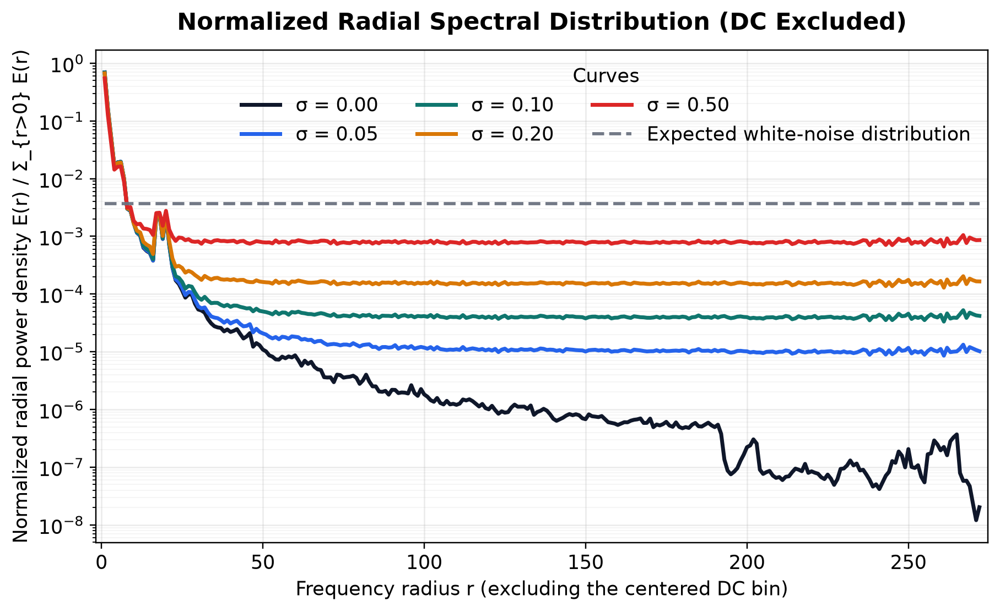
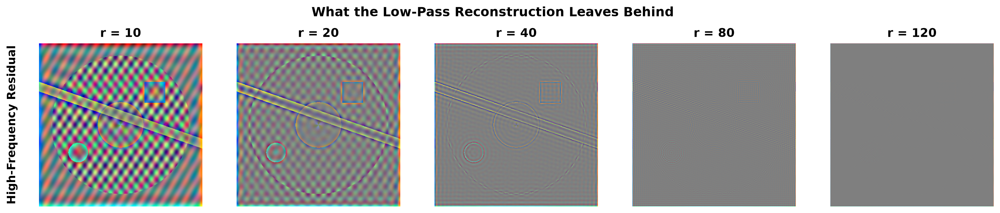
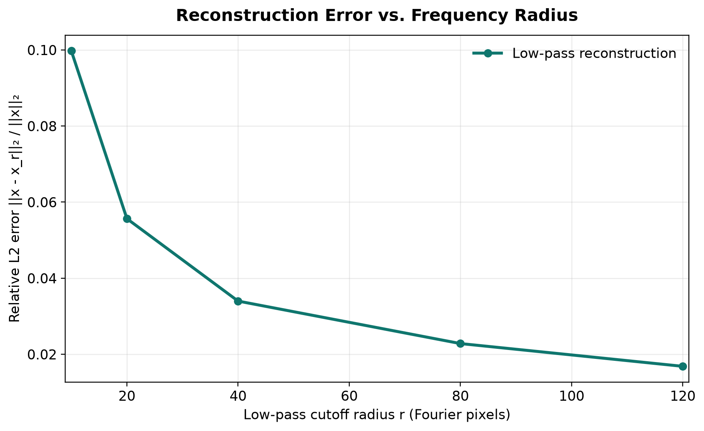

# Spectral Diffusion Playground


Spectral Diffusion Playground is a small research repository for understanding diffusion-model behavior through Fourier analysis, controlled perturbations, and clean visualizations.

**Current status:** Experiments 1–3 are complete. The original Experiments 4
and 5 were superseded after their scope was absorbed into Experiment 3; the
next research question has not yet been selected.

## Scope

This repository is designed for readers who want intuition, not another end-to-end diffusion training stack.

It is meant to provide:

- small experiments with one clear question each
- reproducible scripts rather than notebook-only workflows
- shared utilities collected in a real Python package
- figures that are suitable for research notes, talks, and portfolio review

It is not meant to be:

- a benchmark suite
- a production diffusion library
- a claim-heavy research release before the evidence exists

## Why Fourier Analysis Matters for Diffusion

Diffusion models are usually discussed in pixel space: add noise, predict noise, denoise step by step. That view is useful, but incomplete.

The frequency domain exposes different questions:

- Which structures disappear first as noise increases?
- How do coarse structure and fine detail change across frequency bands?
- When two perturbations look similarly strong in pixel space, do they have the same spectral signature?
- What does a denoiser implicitly need to recover at different frequency bands?

A Fourier view does not replace the standard diffusion formulation. It provides a complementary lens that is often easier to visualize and reason about.

## Design Principles

- One experiment, one question.
- Every experiment should run independently.
- Shared code belongs in `src/spectral_diffusion_playground/`.
- Outputs should be easy to trace back to the script that produced them.
- The repository should stay readable to someone skimming it for five minutes.

## Featured Experiment

### Understanding Images in Fourier Space

Status: Complete.

This experiment turns one image into a compact story:

- original image in pixel space
- centered Fourier magnitude
- log-scaled Fourier magnitude
- inverse FFT reconstruction

Run it with a curated real image once `assets/examples/` is populated:

```bash
python experiments/01_fft_visualization.py \
    --image-path assets/examples/castle.png
```

Today the script still includes a deterministic synthetic fallback so the repo stays runnable even before the curated example set is added.

Display normalization:

- linear magnitude uses exact max normalization after channel averaging
- log magnitude uses `log1p(magnitude + 1e-12)` before the same max normalization

### How Gaussian Noise Changes Frequency Content

Status: Complete.

Motivation: diffusion models add Gaussian noise in pixel space, but the same perturbation becomes easier to reason about when it is inspected in Fourier space. This experiment fixes one image, varies only `sigma` in `x_sigma = x + sigma * epsilon`, and shows both the noisy observations and their spectral summaries.




Run it with a curated real image once `assets/examples/` is populated:

```bash
python experiments/02_noise_vs_frequency.py \
    --image-path assets/examples/castle.png
```

Display normalization:

- noisy images are clipped only for visualization; the additive perturbation itself is not clipped
- log spectra use `log1p(magnitude + 1e-12)` followed by one shared global 99.5th-percentile normalization after channel averaging
- the raw radial analysis also saves annulus-averaged power `E(r)` on a log-scaled y-axis
- the normalized radial spectral-distribution figure excludes the centered DC bin, then plots `E(r) / \sum_{r>0} E(r)` with a dashed white-noise reference line

Takeaway:

- larger `sigma` values visibly erase image structure in pixel space
- the log spectra become more uniformly elevated across the frequency plane as noise dominates the image
- after DC exclusion and normalization, larger `sigma` values spread relative radial power more uniformly across frequency bands

### Where Does Image Information Live in Frequency Space?

Status: Complete.

Motivation: Experiment 2 shows that Gaussian noise changes spectral content.
The next question is what an image looks like when only a controlled,
cumulative region of that spectrum is retained.

Question: How does increasing a circular low-pass cutoff change the reconstructed
image and its remaining reconstruction error?






Run the default radii or provide an image and a custom increasing sequence:

```bash
python experiments/03_frequency_decomposition.py \
    --image-path assets/examples/castle.png \
    --radii 10 20 40 80 120
```

Measurement:

- masks retain centered Fourier coefficients whose Euclidean radius satisfies `distance <= r`
- inverse-FFT reconstructions are measured before display clipping
- reconstruction error is the relative L2 value `||x - x_r||₂ / ||x||₂`
- each residual is the complementary high-pass reconstruction, numerically equal to `x - x_r`
- residual panels share one symmetric 99.5th-percentile display scale across all radii and channels; zero maps to neutral gray

Observation on the deterministic reference image:

- small radii recover smooth variation and coarse geometry
- increasing the retained radius progressively restores finer spatial detail
- complementary residuals contain everything omitted by each cutoff; at larger radii they concentrate increasingly on fine texture and sharp transitions
- relative L2 error decreases across the evaluated radii

Because the masks are nested and the FFT uses orthonormal scaling, non-increasing
L2 error is expected from Parseval's theorem. The image-specific evidence is the
shape of the recovery curve and which visible structures return at each radius,
not the decrease alone.

This decomposition introduces frequency radius and cumulative spectral bands as
precise tools for later denoising experiments. It does not establish that low
frequencies contain semantic information.

## Experiment Roadmap

| Script | Title | Question | Planned output | Status |
| --- | --- | --- | --- | --- |
| `01_fft_visualization.py` | Understanding Images in Fourier Space | What becomes visible in linear and log-scaled centered magnitude spectra? | Reversible pixel-space to frequency-space walkthrough | [x] |
| `02_noise_vs_frequency.py` | How Gaussian Noise Changes Frequency Content | How does additive Gaussian noise change both image-space structure and Fourier-space energy? | Spatial/spectral grid plus radial energy curves | [x] |
| `03_frequency_decomposition.py` | Where Does Image Information Live in Frequency Space? | How does cumulative frequency radius affect reconstruction? | Low-pass reconstruction grid, masks, and relative L2 error | [x] |
| `04_low_pass.py` | What Low-Pass Filtering Preserves | Scope absorbed into Experiment 3 | Retained only as a traceable stub | Superseded |
| `05_high_pass.py` | What High-Pass Filtering Emphasizes | Scope absorbed into Experiment 3 residual analysis | Retained only as a traceable stub | Superseded |

The next numbered experiment should introduce a genuinely new question rather
than repeat cumulative low-pass or high-pass filtering. Before that experiment,
the showcase figures should be regenerated with a curated, provenance-recorded
real image.

## Installation

```bash
python3.11 -m venv .venv
source .venv/bin/activate
pip install --upgrade pip
pip install -r requirements.txt
pip install -e .
```

## Running an Experiment

Each experiment is an independent script:

```bash
python experiments/01_fft_visualization.py
```

To compare RGB and grayscale views in the same artifact:

```bash
python experiments/01_fft_visualization.py --grayscale
```

## Repository Layout

```text
spectral-diffusion-playground/
├── README.md
├── requirements.txt
├── pyproject.toml
├── LICENSE
├── .gitignore
├── src/
│   └── spectral_diffusion_playground/
│       ├── __init__.py
│       ├── fft.py
│       ├── filters.py
│       ├── noise.py
│       ├── visualization.py
│       └── utils.py
├── experiments/
│   ├── _bootstrap.py
│   ├── README.md
│   ├── 01_fft_visualization.py
│   ├── 02_noise_vs_frequency.py
│   ├── 03_frequency_decomposition.py
│   ├── 04_low_pass.py
│   └── 05_high_pass.py
├── assets/
├── figures/
├── docs/
└── tests/
```

## Future Research Directions

- Compare spectral behavior across datasets or semantic classes.
- Replace the synthetic fallback with a curated set of real example images in `assets/examples/`.
- Add animated FFT walkthroughs and GIF exports for recruiting and tutorial use.
- Study whether different noise schedules induce distinct spectral trajectories.
- Connect score estimation and denoising behavior to frequency recovery.
- Examine spectral effects of conditioning, guidance, or architecture choices.
- Use this repository as a base for paper-ready diagnostic figures.

## Citation

If this repository is used in research, cite it as software and include the exact commit hash used for the reported results.

## License

Released under the MIT License. See [LICENSE](LICENSE).
