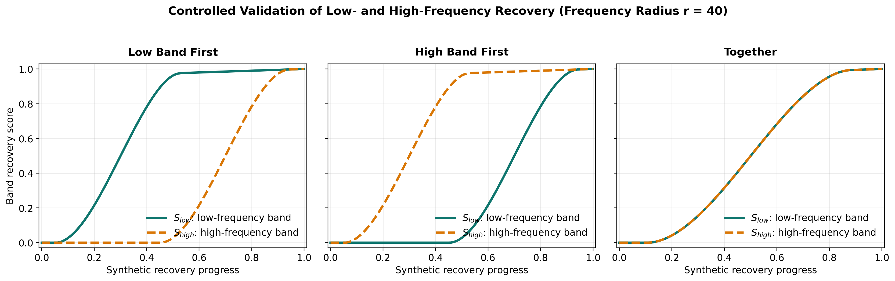
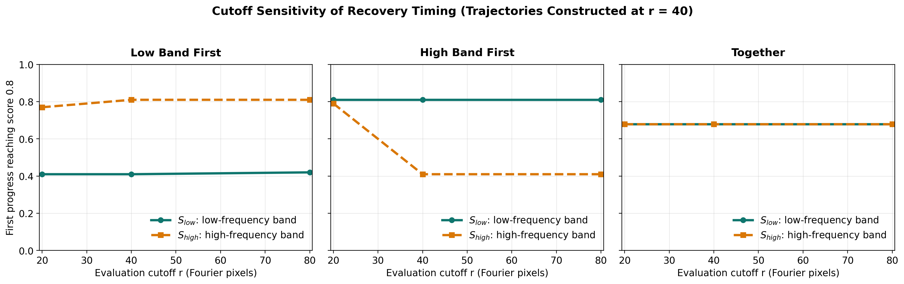

# Spectral Diffusion Playground



Spectral Diffusion Playground develops frequency-band recovery metrics
`S_low` and `S_high` as diagnostics for studying denoising and memorization
dynamics. Fourier analysis, controlled perturbations, and reproducible
visualizations establish how those measurements behave before they are applied
to learned models.

**Current status:** Experiments 1–4 are complete. The frequency-band recovery
metric is validated on controlled trajectories but has not yet been applied to
a real denoiser.

## Scope

This repository is designed for readers who want intuition, not another end-to-end diffusion training stack.

It is meant to provide:

- small experiments with one clear question each
- reproducible scripts rather than notebook-only workflows
- shared utilities collected in a real Python package
- figures that are suitable for research notes, talks, and portfolio review

It is not meant to be:

- a benchmark suite
- a production diffusion library
- a claim-heavy research release before the evidence exists

## Research North Star

The central question is not merely where frequencies live in an image. It is:

> Across training checkpoints, when does memorization become measurable, and
> does it appear differently in low- and high-frequency recovery?

The core measurement is a pair of recovery curves:

- `S_low(t)`: recovery in a DC-excluded low-frequency projection
- `S_high(t)`: recovery in the complementary high-frequency projection

Low-frequency recovery is used as a coarse/global-structure proxy and
high-frequency recovery as a fine-detail proxy. These are operational
frequency bands, not semantic categories.

Two axes must remain separate:

- **Inference dynamics:** how the curves change across noise levels or sampling steps for one fixed model. This is a baseline describing when content becomes visible during denoising.
- **Training dynamics:** how train-versus-held-out recovery gaps change across checkpoints. This is the axis needed to study when memorization manifests.

Experiments 1–3 establish the Fourier representation and projections.
Experiment 4 validates and stress-tests the metric before any model behavior is
interpreted. High-frequency recovery alone is not evidence of memorization;
the relevant signal is a training-specific recovery gap under matched controls.

## Why Fourier Analysis Matters for Diffusion

Diffusion models are usually discussed in pixel space: add noise, predict noise, denoise step by step. That view is useful, but incomplete.

The frequency domain exposes different questions:

- Which structures disappear first as noise increases?
- How do coarse structure and fine detail change across frequency bands?
- When two perturbations look similarly strong in pixel space, do they have the same spectral signature?
- What does a denoiser implicitly need to recover at different frequency bands?

A Fourier view does not replace the standard diffusion formulation. It provides a complementary lens that is often easier to visualize and reason about.

## Design Principles

- One experiment, one question.
- Every experiment should run independently.
- Shared code belongs in `src/spectral_diffusion_playground/`.
- Outputs should be easy to trace back to the script that produced them.
- The repository should stay readable to someone skimming it for five minutes.

## Completed Experiments

### Understanding Images in Fourier Space

Status: Complete.

This experiment turns one image into a compact story:

- original image in pixel space
- centered Fourier magnitude
- log-scaled Fourier magnitude
- inverse FFT reconstruction

Run it with a curated real image once `assets/examples/` is populated:

```bash
python experiments/01_fft_visualization.py \
    --image-path assets/examples/castle.png
```

Today the script still includes a deterministic synthetic fallback so the repo stays runnable even before the curated example set is added.

Display normalization:

- linear magnitude uses exact max normalization after channel averaging
- log magnitude uses `log1p(magnitude + 1e-12)` before the same max normalization

### How Gaussian Noise Changes Frequency Content

Status: Complete.

Motivation: diffusion models add Gaussian noise in pixel space, but the same perturbation becomes easier to reason about when it is inspected in Fourier space. This experiment fixes one image, varies only `sigma` in `x_sigma = x + sigma * epsilon`, and shows both the noisy observations and their spectral summaries.


Run it with a curated real image once `assets/examples/` is populated:

```bash
python experiments/02_noise_vs_frequency.py \
    --image-path assets/examples/castle.png
```

Display normalization:

- noisy images are clipped only for visualization; the additive perturbation itself is not clipped
- log spectra use `log1p(magnitude + 1e-12)` followed by one shared global 99.5th-percentile normalization after channel averaging
- the raw radial analysis also saves annulus-averaged power `E(r)` on a log-scaled y-axis
- the normalized radial spectral-distribution figure excludes the centered DC bin, then plots `E(r) / \sum_{r>0} E(r)` with a dashed white-noise reference line

Takeaway:

- larger `sigma` values visibly erase image structure in pixel space
- the log spectra become more uniformly elevated across the frequency plane as noise dominates the image
- after DC exclusion and normalization, larger `sigma` values spread relative radial power more uniformly across frequency bands

### Where Does Image Information Live in Frequency Space?

Status: Complete.

Motivation: Experiment 2 shows that Gaussian noise changes spectral content.
The next question is what an image looks like when only a controlled,
cumulative region of that spectrum is retained.

Question: How does increasing a circular low-pass cutoff change the reconstructed
image and its remaining reconstruction error?


Run the default radii or provide an image and a custom increasing sequence:

```bash
python experiments/03_frequency_decomposition.py \
    --image-path assets/examples/castle.png \
    --radii 10 20 40 80 120
```

Measurement:

- masks retain centered Fourier coefficients whose Euclidean radius satisfies `distance <= r`
- inverse-FFT reconstructions are measured before display clipping
- reconstruction error is the relative L2 value `||x - x_r||₂ / ||x||₂`
- each residual is the complementary high-pass reconstruction, numerically equal to `x - x_r`
- residual panels share one symmetric 99.5th-percentile display scale across all radii and channels; zero maps to neutral gray

Observation on the deterministic reference image:

- small radii recover smooth variation and coarse geometry
- increasing the retained radius progressively restores finer spatial detail
- complementary residuals contain everything omitted by each cutoff; at larger radii they concentrate increasingly on fine texture and sharp transitions
- relative L2 error decreases across the evaluated radii

Because the masks are nested and the FFT uses orthonormal scaling, non-increasing
L2 error is expected from Parseval's theorem. The image-specific evidence is the
shape of the recovery curve and which visible structures return at each radius,
not the decrease alone.

This decomposition introduces frequency radius and cumulative spectral bands as
precise tools for later denoising experiments. It does not establish that low
frequencies contain semantic information.

### Measuring Low- and High-Frequency Recovery

Status: Complete metric validation; no denoiser evaluated.

For a clean target `x_0`, prediction `x_hat`, DC-excluded low-pass projection
`L*_r`, and complementary high-pass projection `H_r`, Experiment 4 defines:

```text
relative_error(P) = ||P(x_hat) - P(x_0)||_2 / ||P(x_0)||_2
recovery_score(P) = max(0, 1 - relative_error(P))
```

`S_low` uses `P = L*_r`; `S_high` uses `P = H_r`. Here `L*_r` removes the
per-channel spatial mean from the circular
low-pass reconstruction so recovering global brightness or mean color cannot
dominate low-band recovery. This operational definition is
amplitude-sensitive: exact recovery scores one, a missing band scores zero, and
worse-than-zero-baseline estimates remain at zero.


The validation constructs three synthetic trajectories using the same image,
frequency radius `r = 40`, 101 progress values, seed `0`, a fixed target channel
mean, and an initial band-balanced relative noise level of `0.05`.

At recovery score `0.8`, the first threshold crossings are:

| Controlled trajectory | `S_low` | `S_high` |
| --- | ---: | ---: |
| Low band first | `0.41` | `0.81` |
| High band first | `0.81` | `0.41` |
| Together | `0.68` | `0.68` |

The measured ordering matches all three known controls. This validates metric
responsiveness and implementation consistency; it does not show how a real
denoiser behaves. It is intentionally a self-consistency calibration: trajectory
construction and evaluation use the same frequency-band definition. The cutoff
`r = 40` is a design choice, not a universal low/high boundary.

#### Cutoff and Seed Calibration

The same trajectories constructed at `r = 40` are re-evaluated at
`r in {20, 40, 80}` over five deterministic noise seeds. Holding the trajectory
fixed while changing only the measurement cutoff tests whether the measured
ordering depends on the operational frequency-band boundary.



At score `0.8`, low-band-first remains separated across all three cutoffs and
the together control remains coincident. The high-band-first control is
sensitive at `r = 20`: its crossings narrow to `S_low = 0.81` and
`S_high = 0.79`, compared with `0.81` and `0.41` at `r = 40`. Seed standard deviations round to `0.00` at
the trajectory's `0.01` progress resolution. This does not establish cutoff
invariance; it shows where the current operational definition is fragile.

Natural-image and across-image uncertainty remain unmeasured because the
repository does not yet contain a provenance-recorded example set. That
calibration should precede claims about a denoiser.

Run the validation:

```bash
python experiments/04_structure_detail_metrics.py
```

Supplementary outputs:

- `figures/controlled_recovery_trajectories.png`
- `figures/structure_detail_cutoff_sensitivity.png`
- `results/experiment_04_structure_detail_scores.csv`
- `results/experiment_04_cutoff_sensitivity.csv`

## Experiment Roadmap

| Script | Title | Question | Planned output | Status |
| --- | --- | --- | --- | --- |
| `01_fft_visualization.py` | Understanding Images in Fourier Space | What becomes visible in linear and log-scaled centered magnitude spectra? | Reversible pixel-space to frequency-space walkthrough | [x] |
| `02_noise_vs_frequency.py` | How Gaussian Noise Changes Frequency Content | How does additive Gaussian noise change both image-space structure and Fourier-space energy? | Spatial/spectral grid plus radial energy curves | [x] |
| `03_frequency_decomposition.py` | Where Does Image Information Live in Frequency Space? | How does cumulative frequency radius affect reconstruction? | Low-pass reconstruction grid, masks, and relative L2 error | [x] |
| `04_structure_detail_metrics.py` | Measuring Low- and High-Frequency Recovery | Can two frequency-band scores distinguish known recovery orderings? | Controlled two-curve validation and raw scores | [x] |
| `05_natural_image_calibration.py` | Natural Image Calibration of `S_low` and `S_high` | Are the measurements stable across 5–10 provenance-recorded natural images and cutoffs? | Per-image scores, aggregate uncertainty, crossing table, and failure analysis | Specification frozen |
| `06_denoiser_trajectory.py` | Fixed-Model Denoising Baseline | For one pretrained denoiser, when are the two bands recovered across noise levels or sampling steps? | Two inference-time curves; no learning or memorization claim | Blocked on Experiment 5 |
| `07_generalization_vs_memorization.py` | When Does Memorization Manifest? | Across checkpoints, when do matched training, held-out, and oversampled examples develop different recovery curves? | Checkpoint-aligned train-versus-held-out recovery gaps | Planned |

Experiment 5 calibrates the measurement instrument on natural images; its
[frozen specification](docs/experiment_05_natural_image_calibration.md) defines
provenance, preprocessing, schemas, uncertainty, and success criteria.
Experiment 6 is a necessary inference-time baseline, not the primary research
result. Experiment 7 addresses the repository's north star by aligning the two
curves across training checkpoints and comparing matched data groups. Even
there, a high-frequency score is not sufficient evidence of memorization; the
analysis must identify a training-specific gap and rule out simpler
distributional explanations.

## Installation

```bash
python3.11 -m venv .venv
source .venv/bin/activate
pip install --upgrade pip
pip install -r requirements.txt
pip install -e .
```

## Running an Experiment

Each experiment is an independent script:

```bash
python experiments/01_fft_visualization.py
```

To compare RGB and grayscale views in the same artifact:

```bash
python experiments/01_fft_visualization.py --grayscale
```

## Repository Layout

```text
spectral-diffusion-playground/
├── README.md
├── requirements.txt
├── pyproject.toml
├── LICENSE
├── .gitignore
├── src/
│   └── spectral_diffusion_playground/
│       ├── __init__.py
│       ├── fft.py
│       ├── filters.py
│       ├── metrics.py
│       ├── noise.py
│       ├── visualization.py
│       └── utils.py
├── experiments/
│   ├── _bootstrap.py
│   ├── README.md
│   ├── 01_fft_visualization.py
│   ├── 02_noise_vs_frequency.py
│   ├── 03_frequency_decomposition.py
│   ├── 04_structure_detail_metrics.py
│   ├── 05_natural_image_calibration.py
│   ├── 06_denoiser_trajectory.py
│   └── 07_generalization_vs_memorization.py
├── assets/
├── figures/
├── results/
├── docs/
└── tests/
```

## Future Research Directions

- Compare spectral behavior across datasets or semantic classes.
- Replace the synthetic fallback with a curated set of real example images in `assets/examples/`.
- Repeat cutoff calibration on provenance-recorded natural images and report across-image uncertainty.
- Express cutoffs in normalized frequency units when comparing image resolutions.
- Apply the validated scores to fixed-model denoising trajectories.
- Track the same scores across training checkpoints without conflating training and inference time.
- Compare training, held-out, and deliberately oversampled examples when studying memorization.

## Citation

If this repository is used in research, cite it as software and include the exact commit hash used for the reported results.

## License

Released under the MIT License. See [LICENSE](LICENSE).
