# Spectral Diffusion Playground

[](https://www.python.org/)
[](#installation-and-reproduction)
[](LICENSE)
[](https://github.com/xinyugao233/spectral-diffusion-playground/tree/portfolio-v1)

A research portfolio of frequency-resolved experiments for understanding
denoising and memorization in diffusion models.

The central question is: **how do low- and high-frequency residual transitions
relate to the medium-noise region independently motivated by Gaussian-shell
coverage and posterior-weight concentration?**

Experiments E001-E003 build the Fourier foundation. E004-E008 form a
paper-derived clean-room pipeline grounded in
[*Two Calm Ends and the Wild Middle: A Geometric Picture of Memorization in
Diffusion Models*](https://arxiv.org/abs/2602.17846).

## Canonical Experimental Pipeline

| Stage | Experiment | Selection source | Output |
| --- | --- | --- | --- |
| 1 | E004 | Human-audited Fourier cutoff protocol | `r=4`, sensitivity `r=3,5` |
| 2 | E004A | Coverage and posterior-weight geometry | Candidate geometry target `8..9` |
| 3 | E004B | Frequency-restricted coverage and posterior geometry | Low target `8`; high target `9..10` |
| 4 | E005 | Low/high residual curves at frozen `r` | Spectral interpretation |
| 5 | E006 | Historical spectral/reference swaps | Exploratory; `INCONCLUSIVE` |
| 6 | E007 | Full-space geometry swap over `8..9` | Proposed; blocked |
| 7 | E008 | Frequency-geometry swaps | Preflight complete: `BLOCKED_NO_ELIGIBLE_PAIR`; swaps unexecuted |
| 8 | E009 | Intermediate-dataset model design | Stage A protocol frozen; training pending smoke |


E004A computes the paper's original full-space coverage and posterior-weight
curves. E004B projects the same data and Gaussian corruptions into the frozen
low- and high-frequency subspaces and computes coverage and posterior
concentration separately in each subspace.

For each frequency band, E004B draws two geometric curves: coverage and
maximum posterior weight. These are distinct from E005's low/high denoising
residual-energy curves. Neither spectral measurement revises the E004A
full-space target.

The frequency-specific extension follows this frozen order:

```text
E004: freeze r
  -> E004A: retain the full-space geometry baseline
  -> E004B: compute low/high frequency-restricted geometry
  -> select separate low/high geometry targets
  -> E005: compare with low/high residual dynamics
  -> E008: propose frequency-targeted temporal swap tests
```

See the [canonical pipeline specification](docs/canonical_experiment_pipeline.md)
and [machine-readable registry](results/canonical_experiment_pipeline.json).

## Key Visual Highlights

The paper's original geometric picture uses two full-space quantities:
Gaussian-shell coverage `C_sigma(p,D)` and maximum empirical-posterior weight
`W_sigma(D)`. This repository provides a paper-derived clean-room reproduction;
the original Figure 3 execution artifacts were unavailable.

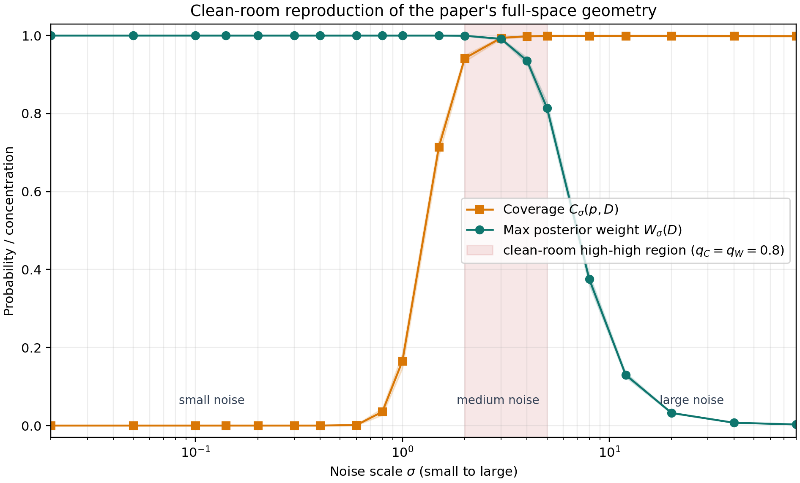

E004B asks how that same geometry decomposes across the frozen Fourier bands.
At `r=4`, the conservative lower-confidence-bound rule selects low-band index
`8` and high-band indices `9..10`.

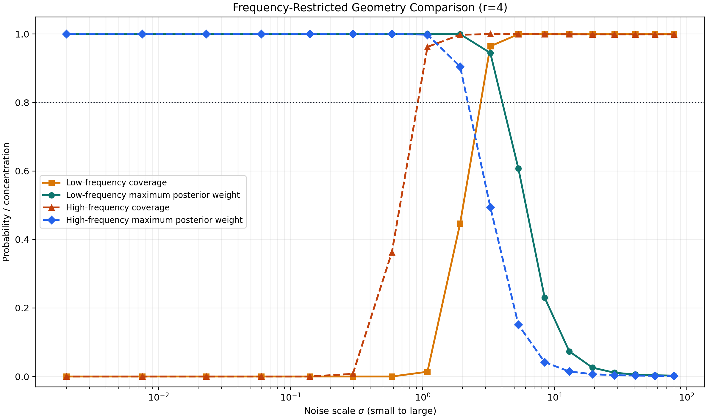

E005 adds a separate spectral analysis. It reveals two ordered residual-energy
transitions in a fixed denoiser: the low-frequency residual changes at higher
noise, followed by the high-frequency residual at lower noise.

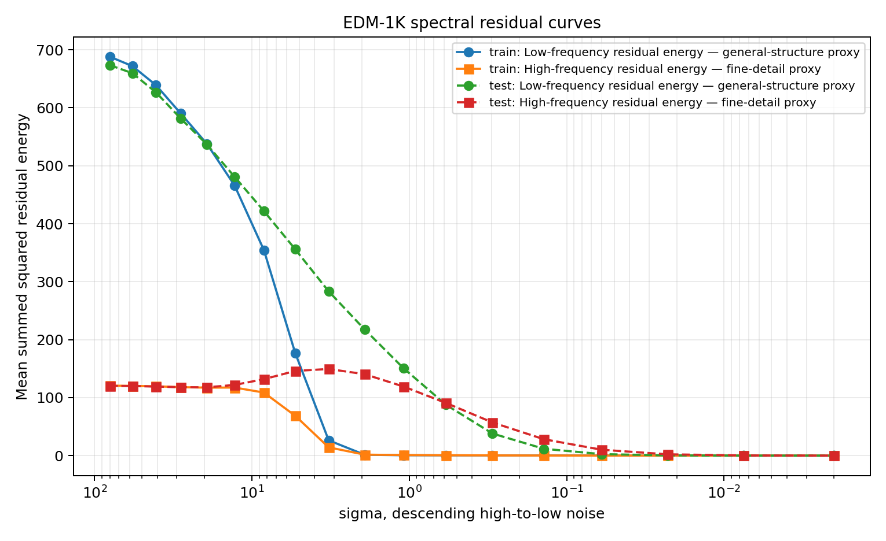

**Headline result:** on the exact sampler schedule, the clean-room coverage and
posterior-weight curves select indices `8..9` as the geometry-defined high-high
region at `q_C=q_W=0.8`. These points lie inside the E005 low-frequency
spectral transition and precede the high-frequency transition. A final
whole-denoiser swap over indices `8..9` is specified in E007 but is blocked
until a nondegenerate model pair is preregistered.

E006 is the historical exploratory spectral-window intervention. Its formal
outcome is **`INCONCLUSIVE`** because the EDM-50K no-swap baseline is
degenerate. E006 did not test the later E004A-selected target `8..9`.

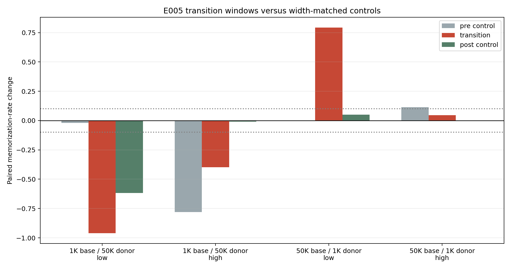

## Start Here

- **Freeze the spectral measurement first:** [E004 cutoff](#e004-selecting-an-operational-cifar-10-cutoff).
- **Select the candidate interval geometrically:** [coverage and posterior concentration](#original-paper-geometry-coverage-and-posterior-concentration).
- **Inspect geometry inside each Fourier band:** [E004B frequency-restricted geometry](#e004b-frequency-restricted-gaussian-shell-geometry).
- **See the spectral extension:** [E005 residual curves and transition windows](#e005-low--and-high-frequency-residual-transitions).
- **Review the historical intervention:** [E006 spectral-window swaps](#e006-historical-spectral-window-swaps).
- **See the required final test and blocker:** [proposed E007](#e007-final-geometry-aligned-whole-denoiser-swap).
- **See the completed model-pair gate:** [E008 preflight](#e008-proposed-frequency-geometry-whole-denoiser-swaps).
- **Audit the evidence:** [E005 result record](docs/experiment_05_spectral_residual_results.md)
  and [E006 result record](docs/experiment_06_transition_window_swap_results.md).
- **Reproduce the foundations locally:** [installation and commands](#installation-and-reproduction).

## Experiment Map

| Experiment | Question | Main figure | Result | Status |
| --- | --- | --- | --- | --- |
| E001 | What does a 2D Fourier transform represent? | [FFT visualization](figures/understanding_images_in_fourier_space_default_fft_reference_rgb.png) | Pixel-to-frequency conversion is reversible | Complete |
| E002 | How does Gaussian noise change spectral content? | [Noise/frequency grid](figures/how_gaussian_noise_changes_frequency_content_default_fft_reference_seed0_grid.png) | Noise raises energy broadly across frequency | Complete |
| E003 | Where does image information appear across frequency radii? | [Decomposition grid](figures/where_image_information_lives_grid.png) | Complementary low/high reconstructions exactly recover the image | Complete |
| E004 | Which cutoff is a useful operational CIFAR-10 split? | [Cutoff montage](figures/experiment_04_cutoff_montage_classes_0_1.png) | Reference `r = 4`; sensitivity `r = 3, 5` | Complete |
| E004A | What are the paper's original two geometric curves? | [Coverage/concentration curves](figures/experiment_04a/coverage_and_max_posterior_weight.png) | Clean-room three-regime geometry; sampled high-high region at `sigma = 2..5` | Complete |
| E004B | How does the same geometry differ across frozen Fourier bands? | [Band comparison](figures/experiment_04b/low_high_geometry_comparison.png) | Low target `{8}`; high target `{9,10}` at `r=4` | Complete |
| E005 | When do low/high residual energies transition across noise levels? | [Two residual curves](figures/experiment_05/experiment_05_edm1k_low_high_residual_curves.png) | Low-frequency transition precedes high-frequency transition | Complete |
| E006 | What happened in the historical spectral-aligned swaps? | [Swap/control chart](figures/experiment_06/experiment_06_transition_vs_controls.png) | Exploratory; formal outcome `INCONCLUSIVE` | Complete |
| E007 | Does a swap over the E004A geometry-aligned set alter the criterion? | [Blocked protocol](docs/experiment_07_geometry_aligned_swap_protocol.md) | No result | Proposed; blocked by known baseline degeneracy |
| E008 | Do swaps over the E004B band-specific targets differ from controls? | [Preflight results](figures/experiment_08_preflight/pilot_baseline_rate_by_checkpoint.png) | `BLOCKED_NO_ELIGIBLE_PAIR`; no swap result | Preflight complete; swaps blocked and unexecuted |
| E009 | Can intermediate dataset sizes yield a nondegenerate larger-data baseline? | [Frozen Stage A protocol](docs/experiment_09_intermediate_dataset_training_design.md) | No result | Protocol frozen; training pending smoke |

## E001: Understanding Images In Fourier Space

**Question.** What information does a channelwise 2D Fourier transform expose,
and can the original image be recovered? E001 computes the centered FFT,
linear and log-magnitude spectra, and inverse FFT with orthonormal
normalization. The reconstruction matches the input up to numerical precision.


- **Purpose:** Build intuition for the reversible pixel-space to frequency-space
  transformation.
- **Main artifact:** [RGB FFT visualization](figures/understanding_images_in_fourier_space_default_fft_reference_rgb.png)
  and [RGB/grayscale comparison](figures/understanding_images_in_fourier_space_default_fft_reference_rgb_and_grayscale.png).
- **Takeaway:** Fourier space reorganizes image variation by spatial frequency;
  it does not discard information by itself.

```bash
python experiments/01_fft_visualization.py
python experiments/01_fft_visualization.py --grayscale
```

## E002: How Gaussian Noise Changes Frequency Content

**Question.** How does additive white Gaussian noise alter an image and its
spectrum? E002 evaluates five frozen noise levels and compares pixel-space
corruption with log spectra and radial energy distributions. Increasing noise
raises energy broadly across spatial frequencies and makes the normalized
DC-excluded profile more uniform.


- **Purpose:** Connect pixel-space corruption to frequency-space behavior.
- **Main artifact:** [Noise/frequency grid](figures/how_gaussian_noise_changes_frequency_content_default_fft_reference_seed0_grid.png)
  and [normalized radial distribution](figures/how_gaussian_noise_changes_frequency_content_default_fft_reference_seed0_normalized_radial_distribution.png).
- **Takeaway:** White noise contributes broadly rather than occupying one
  narrow frequency band.

```bash
python experiments/02_noise_vs_frequency.py
```

## E003: Where Does Image Information Live?

**Question.** What becomes visible as progressively larger centered frequency
regions are retained? E003 applies nested circular low-pass masks and exact
complementary high-pass masks. The low-pass reconstruction and signed residual
sum back to the input, while the reconstruction-error curve quantifies how
rapidly image content is recovered.


- **Purpose:** Establish the complementary projection operators used later.
- **Main artifact:** [Reconstruction grid](figures/where_image_information_lives_grid.png),
  [high-frequency residuals](figures/high_frequency_residuals.png), and
  [error curve](figures/reconstruction_error_vs_frequency_radius.png).
- **Takeaway:** Increasing radius progressively restores image variation, but
  frequency bands remain operational measurements rather than semantic labels.

```bash
python experiments/03_frequency_decomposition.py
```

## E004: Selecting An Operational CIFAR-10 Cutoff

**Question.** Which centered radial cutoff provides a useful and auditable split
on 32 x 32 CIFAR-10 images? E004 freezes 20 examples, six candidate radii, exact
display conventions, and reconstruction/energy diagnostics before review. A
single disclosed reviewer selected `r = 4` as the smallest visually acceptable
cutoff; `r = 3` and `r = 5` remain the primary sensitivity cutoffs.

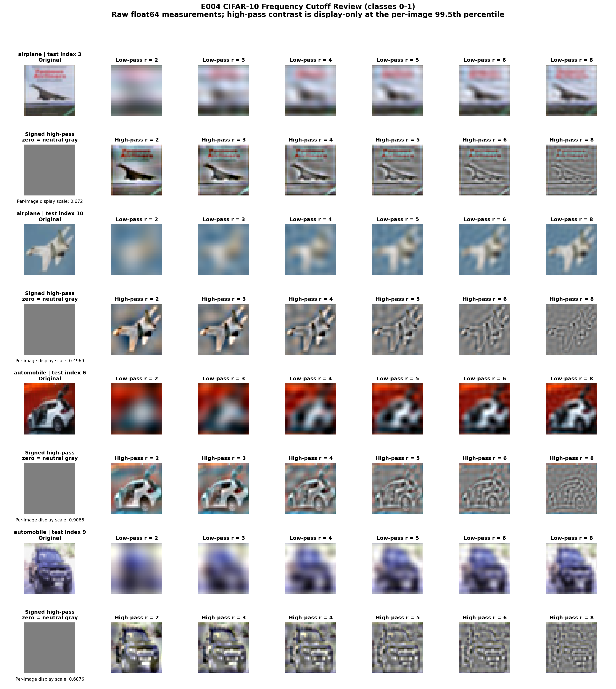

- **Purpose:** Freeze an operational frequency split before examining denoiser
  curves.
- **Main artifact:** [Five class-grouped cutoff montages](figures/README.md#e004-operational-frequency-cutoff)
  and the [decision record](docs/experiment_04_frequency_cutoff_decision.md).
- **Takeaway:** `r = 4` is a documented experimental choice, not a universal
  boundary between structure and detail.

The originally planned two-independent-reviewer scoring procedure was not
completed. No inter-rater or blinded-review claim is made.

## Original Paper Geometry: Coverage And Posterior Concentration

The paper's geometric picture is defined by two quantities that are distinct
from the repository's Fourier residual energies.

For training set `D = {x_i}`, paper Eq. (3) assigns empirical-posterior weight

```text
w_i(y,sigma) = exp(-||y-x_i||^2 / (2 sigma^2))
               / sum_j exp(-||y-x_j||^2 / (2 sigma^2)).
```

Definition 4.1 averages the largest weight for noisy **training** queries:

```text
W_sigma(D) = E_{X ~ p_D, Z} max_i w_i(X + sigma Z, sigma).
```

Definition 4.6 measures whether a noisy **held-out** query lies in the union of
training-centered Gaussian shells:

```text
C_sigma(p,D) = P(X + sigma Z in union_i S_sigma(x_i)),  X ~ p.
```

Here `p` is the data distribution, not a scalar shell-probability parameter.
The shell radii use the paper's `c = 5` convention and include both annulus
boundaries. Coverage is an exact binary union-of-annuli event; it is not a
nearest-neighbor-distance substitute.


The relationship motivates three qualitative regimes:

- **Small noise:** posterior concentration is high, but held-out shell coverage
  is limited.
- **Medium noise:** coverage and posterior concentration can be simultaneously
  high, producing a clean-room candidate geometric region under the explicit
  thresholds `q_C = q_W = 0.8`.
- **Large noise:** coverage is broad, but posterior concentration is weak.

The paper does not provide a universal numerical boundary for these regimes.
The clean-room protocol froze exploratory thresholds `q_W = q_C = 0.8` before
execution; sampled full-space point estimates are high-high at
`sigma in {2,3,4,5}`. Continuous shading from `2` to `5` is visual only, and
decisions use observed grid points without interpolation.

Evaluating the same definitions directly on the exact 18-point E006 sampler
grid selects indices `{8,9}`, at `sigma in {3.2568215, 1.9233398}`, under both
the point-estimate and 95% lower-bound rules. This is the **E004A clean-room
geometric high-high region** at `q_C=q_W=0.8`, not a universal paper boundary.

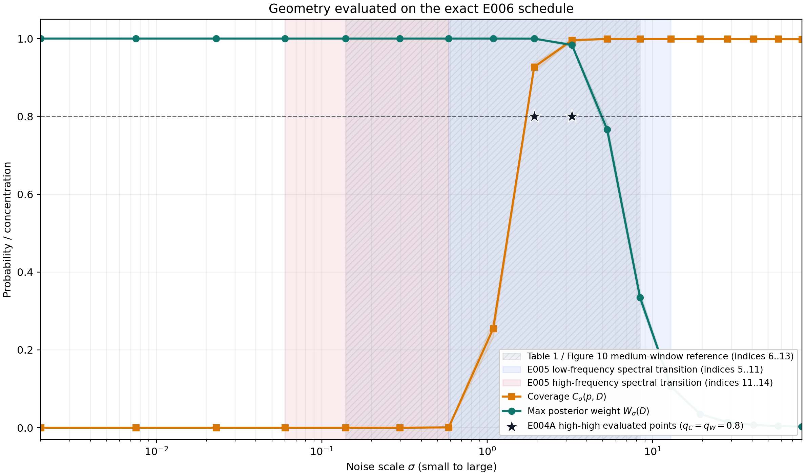

This is a **paper-derived clean-room reproduction**, not an exact numerical
reproduction. It uses the first 1,000 canonical CIFAR-10 training and test
images, seed `0`, and a frozen 20-point sigma grid because the paper's exact
subset, seeds, grid, and executed Figure 3 code were unavailable. See the
[source audit](docs/paper_geometry_source_audit.md), [frozen protocol](docs/experiment_04a_paper_geometry_protocol.md),
and [result record](docs/experiment_04a_paper_geometry_results.md).

The committed estimates can also be regenerated end to end from a local
CIFAR-10 archive using the frozen configuration:

```bash
python experiments/04a_paper_geometry_curves.py \
  --compute \
  --dataset-root /path/to/cifar10 \
  --output-dir results/experiment_04a_reproduction \
  --device auto
```

This mode computes both curves from images and deterministic Gaussian draws;
it does not use committed estimates as numerical inputs. `--plot-only` retains
the lightweight figure-regeneration path, and `--validate-only` checks an
existing result directory without recomputation.

The recorded end-to-end CPU run completed in 3.31 seconds with 441.8 MiB peak
resident memory. Every sigma passed the tolerance frozen before execution;
maximum absolute differences were `1.11e-16` for coverage and `4.72e-16` for
maximum posterior weight. The sampled high-high set remained `{2,3,4,5}`.
See the [fresh reproduction artifacts](results/experiment_04a_reproduction/)
and [comparison record](results/experiment_04a_reproduction/reproduction_comparison.csv).

This is an end-to-end local regeneration under the frozen clean-room
configuration. It is independent of the committed curve estimates, but uses
the same subset, seed, sigma grid, estimator, normalization, and Gaussian
draws. The near-exact agreement establishes deterministic reproducibility, not
robustness across alternative subsets or seeds.

## E004B: Frequency-Restricted Gaussian-Shell Geometry

**Question.** Does the paper-derived coverage/concentration geometry occupy
the frozen low- and high-frequency subspaces at the same noise levels? E004B
uses the same CIFAR-10 examples, 18-point schedule, Gaussian corruptions, and
definitions as E004A, then computes both quantities after exact complementary
Fourier projection.

E004B draws two curves in the low-frequency subspace and two curves in the
high-frequency subspace: coverage and maximum posterior weight in each space:

```text
C_low_sigma(p,D)
W_low_sigma(D)
C_high_sigma(p,D)
W_high_sigma(D)
```

This distinction is structural:

```text
E004B = frequency-restricted data geometry
E005  = frequency-restricted denoising residual energy
```

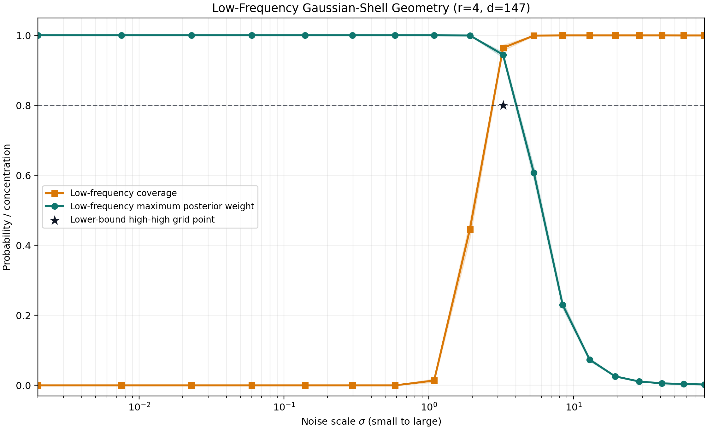

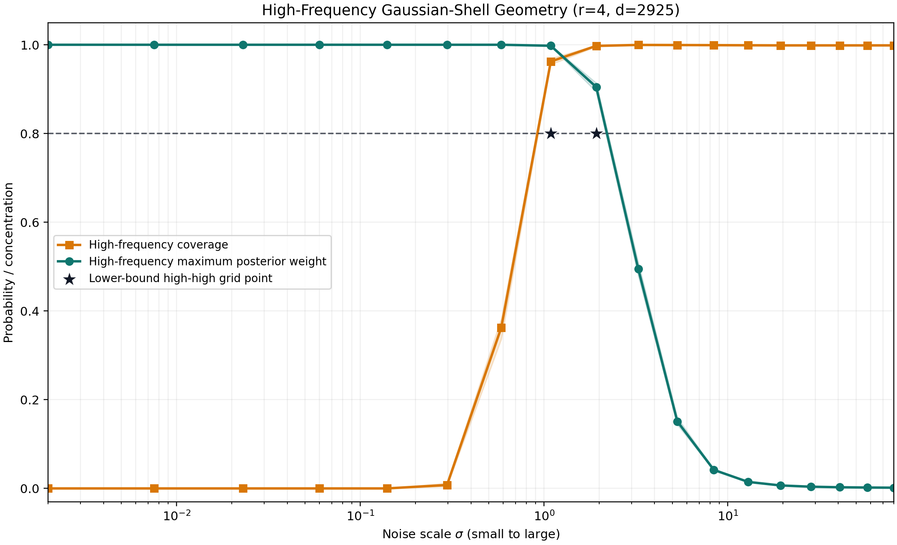

At the primary cutoff `r=4`, the exact real subspace ranks are 147 (low) and
2,925 (high). Applying the frozen `q_C=q_W=0.8` lower-confidence-bound rule
selects low-band index `{8}` at `sigma=3.2568215` and high-band indices
`{9,10}` at `sigma={1.9233398,1.0881706}`. Point-estimate classification
agrees at the primary cutoff.

**Headline interpretation:** at `r=4`, the joint low-band high-high target is
`{8}` and the joint high-band target is `{9,10}`. This is a descriptive
ordering in the operational Fourier decomposition; the large rank difference
between the two subspaces prevents attributing the difference to frequency
organization alone.

At `r=4`, the low- and high-frequency projectors have substantially different
ranks, `147` and `2925`. E004B therefore measures the geometry of the actual
operational Fourier decomposition, but it does not isolate frequency
organization from subspace dimension, covariance, or energy structure.
Rank- and power-matched control subspaces would be required before attributing
the observed ordering specifically to frequency.

The low-band joint high-coverage/high-posterior target occurs one sampler
index earlier than the high-band target. This statement concerns the joint
high-high regions. Coverage alone does not exhibit the same ordering: the
high-band coverage threshold persists to lower sigma, while low-band posterior
concentration persists farther toward high noise.

The low target is unchanged at `r=3,4,5`. The high target is `{9,10}` at
`r=3,4`, while its lower-bound sensitivity result narrows to `{10}` at `r=5`.
This dependence remains visible and does not revise `r=4`.

- **Purpose:** Extend the paper geometry into preregistered complementary
  frequency subspaces without using denoiser outputs.
- **Main artifact:** [Band comparison](figures/experiment_04b/low_high_geometry_comparison.png),
  [cutoff sensitivity](figures/experiment_04b/frequency_geometry_cutoff_sensitivity.png),
  and [validated results](docs/experiment_04b_frequency_restricted_geometry_results.md).
- **Takeaway:** Under the frozen clean-room setup, the low-band geometric
  target occurs one sampler index earlier at higher noise, while the high-band
  target occupies the next two lower-noise points. This is descriptive
  geometry, not causal or memorization evidence.

```bash
python experiments/04b_frequency_restricted_geometry.py \
  --compute \
  --dataset-root /path/to/cifar10 \
  --output-dir results/experiment_04b_reproduction \
  --figure-dir figures/experiment_04b_reproduction \
  --device cpu \
  --cutoffs 3 4 5
```

## E005: Low- And High-Frequency Residual Transitions

**Question.** How does the paper-derived fixed-sigma denoising residual divide
between complementary frequency bands? E005 projects the residual directly,
uses float64 spectral calculations after float32 inference, and verifies
`E_full = E_low + E_high` numerically. This is the central two-curve diagnostic
for the repository's **spectral extension**, not the paper's original two
geometric curves.

For a clean image `X`, Gaussian noise `Z`, noise level `sigma`, and fixed
denoiser `m_sigma`, the residual is

```text
e_sigma = m_sigma(X + sigma Z) - X
```

E005 measures its summed squared magnitude in two exact complementary Fourier
bands:

```text
E_low(sigma)  = ||P_low,r e_sigma||_2^2
E_high(sigma) = ||P_high,r e_sigma||_2^2
```

Here, **residual energy** is the summed squared error remaining after denoising,
projected into either the low- or high-frequency band. The curves are not
image-quality scores or memorization rates; they measure how much denoising
error remains in each band at each fixed noise level.


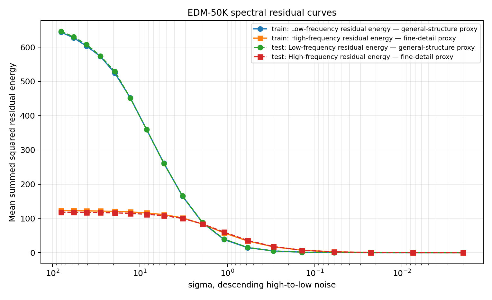

### How The Transition Windows Are Extracted

The rule is applied **independently** to each aggregated low- and
high-frequency residual-energy curve on the frozen 18-point sigma grid. It
does not use the intersection of the two curves. The grid is traversed from
large sigma (high noise) to small sigma (low noise), without smoothing or
interpolation.

For one band, let `E_i` be its aggregated residual energy at grid index `i`.
The **high-noise endpoint** is the median of indices `0, 1, 2`; the
**low-noise endpoint** is the median of indices `15, 16, 17`. These endpoints
convert energy into a normalized recovery quantity:

```text
E_high-noise = median(E_0, E_1, E_2)
E_low-noise  = median(E_15, E_16, E_17)

R_i = (E_high-noise - E_i)
      / (E_high-noise - E_low-noise)

entry = first two consecutive points with R_i >= 0.20
exit  = first two consecutive points with R_i >= 0.80
```

Approximately, `R = 0` represents the high-noise residual level and `R = 1`
the low-noise residual level. Values are not clipped, so endpoint overshoot
remains visible. The **transition entry** is the first index beginning a pair
of consecutive values at or above `0.20`. Starting from that entry, the
**transition exit** is the first index beginning a pair at or above `0.80`.
The inclusive entry-to-exit interval is the extracted window.

The implementation returns `no_clear_transition` for a nonfinite curve, a
nonpositive or nonfinite endpoint difference, a missing crossing, an exit
before entry, a zero-width window, or a later two-point recrossing below either
threshold. It never widens or manually moves a failed window. At the reference
cutoff `r = 4`, entry and exit must each be within one grid index of the
corresponding `r = 3` and `r = 5` boundaries to be marked
`adjacent_cutoff_stable=true`.

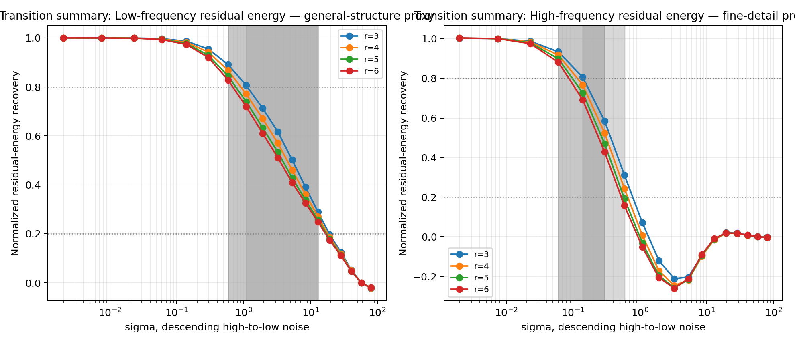

The trajectory proceeds from large sigma to small sigma. At the reference
cutoff `r = 4`, the frozen EDM-1K test result is:

| Band | Transition indices | Sigma window | Adjacent-cutoff stable |
| --- | --- | --- | --- |
| Low-frequency residual | `5..11` | `12.9101..0.585348` | `true` |
| High-frequency residual | `11..14` | `0.585348..0.0599473` | `true` |

The low-frequency transition therefore occurs first, at higher sigma; the
high-frequency transition follows later, at lower sigma. Their shared boundary
near `sigma = 0.585348` is a descriptive coarse-to-fine handoff under this
fixed-denoiser measurement. These are fixed-sigma denoising residual
transitions, not training-time learning transitions.

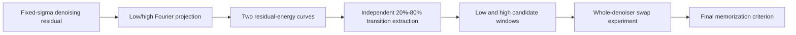

- **Purpose:** Turn the structure/detail intuition into exact, complementary
  residual-energy measurements.
- **Main artifact:** [Two-curve figures](figures/experiment_05/),
  [transition-window visualization](figures/experiment_05/experiment_05_transition_windows.png),
  and [validated results](docs/experiment_05_spectral_residual_results.md).
- **Takeaway:** Low-frequency residual recovery transitions earlier and
  high-frequency residual recovery transitions later under this fixed-denoiser
  setup. This is a descriptive coarse-to-fine residual pattern, not a learning
  dynamic or memorization result.

### Distinguishing Geometry, Spectral Transitions, And Literature Context

The paper's geometric motivation comes from Gaussian-shell coverage and
posterior-weight concentration. E005's low- and high-frequency residual curves
provide a separate spectral description of denoising error across the noise
schedule. Their intersection, the space between them, and their 20%-to-80%
windows do **not** define a geometric high-high region or an original paper
boundary.

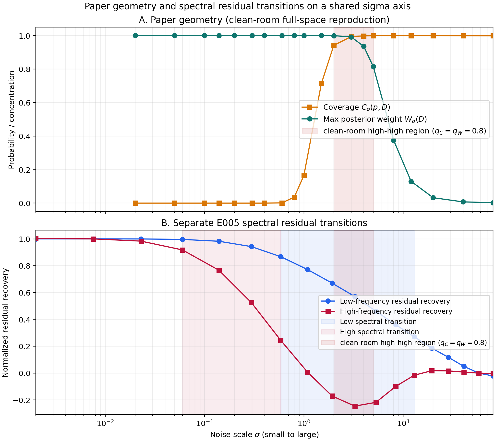

Both panels use the same small-to-large log-scaled sigma orientation. The
geometry uses a frozen 20-point grid; E005 uses its frozen 18-point EDM grid.
No interpolation is used for decisions. On the exact shared 18-point schedule,
the E004A high-high indices `{8,9}` at `q_C=q_W=0.8` lie inside the E005
low-frequency spectral transition `5..11` and the literature-derived
paper-reported medium reference `6..13`. They do not overlap the E005
high-frequency spectral transition `11..14`. This is descriptive set overlap,
not a statistical or causal result.

E006 tests trajectory intervals aligned with the **spectral** transitions by
swapping the whole denoiser between EDM-1K and EDM-50K. It does not directly
intervene on coverage, posterior weights, or isolated Fourier components. The
formal E006 outcome remains **`INCONCLUSIVE`** because the EDM-50K no-swap
baseline was degenerate at `0/256`.

Before E004A, E006 used spectral transition windows and a paper-reported
medium-window reference. These were useful intervention windows, but they were
not derived from locally reconstructed coverage and posterior-weight curves.
E004A now supplies that missing geometric baseline. E006 tested
spectral-aligned windows and a literature-derived paper medium reference. It
did not preregister a window from locally computed coverage and
posterior-weight curves, because E004A did not yet exist.

## E006: Historical Spectral-Window Swaps

**Question.** Are the E005 **spectral** transition windows more influential for
final trajectory-level memorization than width-matched controls? E006 runs
whole-denoiser swaps in both EDM-1K/EDM-50K directions with the same 256 latent
seeds and evaluates the strict pixel-space criterion `d1NN < d2NN / 3`.


The generated/nearest-neighbor pairs below make the strict pixel-space
memorization criterion visually concrete. They are examples from the frozen
evaluation, not a substitute for the aggregate decision rule.

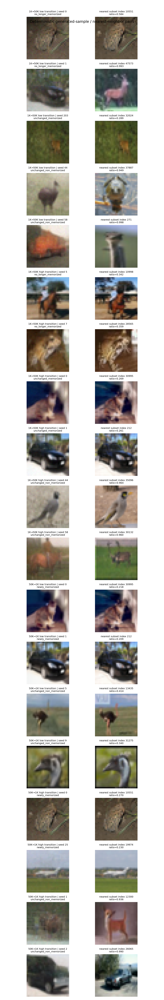

- **Purpose:** Explore whether historically frozen E005 spectral windows matter
  under a controlled whole-denoiser swap intervention.
- **Main artifact:** [Transition/control chart](figures/experiment_06/experiment_06_transition_vs_controls.png),
  [memorization-rate chart](figures/experiment_06/experiment_06_memorization_rates.png),
  [paired-change chart](figures/experiment_06/experiment_06_paired_changes.png),
  and [validated results](docs/experiment_06_transition_window_swap_results.md).
- **Takeaway:** The formal outcome is **`INCONCLUSIVE`** because the EDM-50K
  baseline is degenerate at `0/256`. Descriptively, the E005 low-frequency
  spectral transition passes the frozen influence criterion in both swap
  directions; the E005 high-frequency spectral transition passes in neither.

The descriptive result does not override the frozen outcome or establish a
causal memorization interpretation for any sigma interval.

The low-frequency spectral transition produced the strongest descriptive E006
swap effect, but E006 remained formally `INCONCLUSIVE` and did not identify a
memorization danger zone. It therefore does not complete the final
geometry-aligned intervention in the canonical pipeline.

E006 swaps the **whole denoiser** during windows aligned with the E005
frequency-band transitions. It does not intervene on `C_sigma`, `W_sigma`, or
only the low- or high-frequency part of a denoiser output. The justified
descriptive statement is therefore about the trajectory interval, not a
frequency-specific causal mechanism or validation of the paper's geometry.

See the [region-definition audit](docs/danger_zone_definition_audit.md),
[machine-readable registry](results/region_definition_registry.json), and
[proposed E007 protocol](docs/experiment_07_geometry_aligned_swap_protocol.md)
for the exact historical distinctions.

## E007: Final Geometry-Aligned Whole-Denoiser Swap

E004A identifies the candidate geometric region. E005 describes its spectral
location. E007 is the required intervention that directly tests whether this
geometry-selected interval is unusually influential for memorization.

The frozen target is `8..9`, with width-matched controls `6..7` and `10..11`.
The question is whether swapping the whole denoiser exactly over the
independently geometry-defined high-high interval changes final memorization
more than those equally wide neighboring intervals.

E007 remains **PROPOSED — BLOCKED BY KNOWN BASELINE DEGENERACY**. The final
geometry-aligned swap target is frozen at indices `8..9`, but the historical
model pair cannot be used for an informative bidirectional test because the
EDM-50K baseline is already `0/256`. A nondegenerate model pair must be
selected through the preregistered baseline-only preflight before E007 can run.
No E007 swap has been executed.

See the [blocked E007 protocol](docs/experiment_07_geometry_aligned_swap_protocol.md).

## E008: Proposed Frequency-Geometry Whole-Denoiser Swaps

E008 is the unexecuted band-specific intervention implied by E004B. It would
swap the **whole denoiser** over low target `8..8` and high target `9..10`,
each compared with immediately adjacent width-matched controls. It does not
swap Fourier coefficients or isolated frequency outputs.

The primary bidirectional design is **PROPOSED — NOT EXECUTED**. Its
preregistered baseline-only checkpoint preflight is complete. Six EDM-1K
intermediate checkpoints passed the frozen `13..115` out of `128` eligibility
rule, but all 21 EDM-50K checkpoints were `0/128`. The formal preflight outcome
is **`BLOCKED_NO_ELIGIBLE_PAIR`**. No E008 swap, confirmatory inference, or
swap result exists.

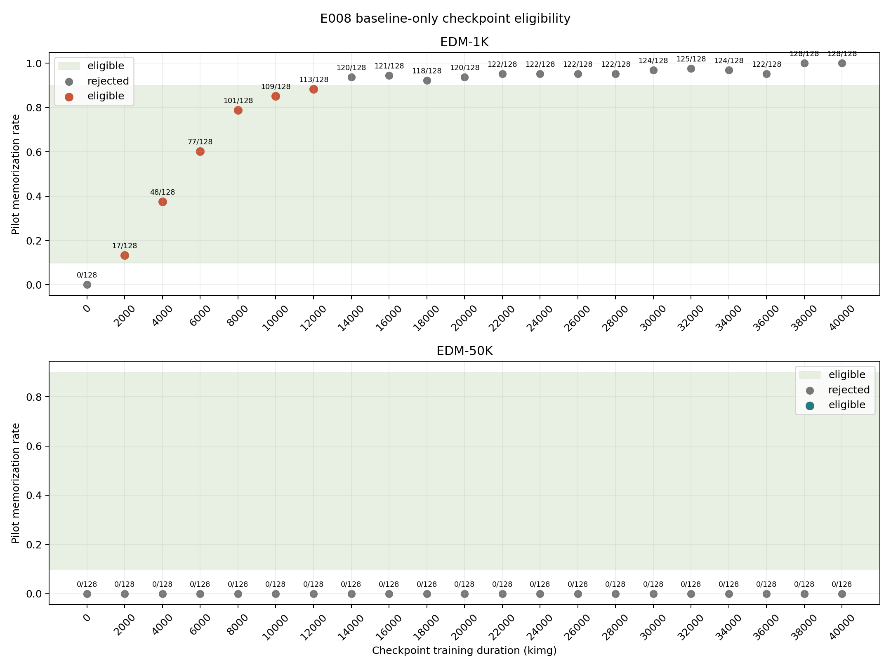

The result does not establish that every 50K-data model is degenerate, but it
does show that training longer along the available EDM-50K trajectory is not
the useful next control. A separate intermediate-dataset design is proposed
in [E009](docs/experiment_09_intermediate_dataset_training_design.md); no new
training has started.

See the [baseline preflight protocol](docs/experiment_08_checkpoint_preflight.md)
and [results](docs/experiment_08_checkpoint_preflight_results.md), plus the
[blocked E008 protocol](docs/experiment_08_frequency_geometry_swap_protocol.md).

## E009: Staged Intermediate-Dataset Model Design

E009 freezes a fast two-stage search for a nondegenerate larger-data baseline.
Stage A uses deterministic nested, class-balanced CIFAR-10 subsets at 2K, 5K,
and 10K, with matched EDM settings, 12K-kimg budgets, and snapshots every 1K
kimg. All three runs use training seed `0` and are designed for one parallel
Slurm array.

The future baseline pilot uses seeds `20000..20127`, never reuses E008 pilot
seeds `10000..10127`, and keeps confirmatory seeds `0..255` untouched. The
eligibility interval remains `13..115 / 128`. Pair selection minimizes the
baseline-rate gap, then prefers the larger new dataset, then uses checkpoint
hash order. At least a 5K model is required to unblock E008; a 2K-only result
triggers the separately reviewed Stage B.

See the [frozen E009 protocol](docs/experiment_09_intermediate_dataset_training_design.md)
and [nested subset manifest](data/e009_nested_subsets_manifest.json). E008
remains blocked and unexecuted throughout model selection.

## Mathematical Core

The paper geometry first measures full-space coverage and concentration:

```text
C_sigma(p,D) = P(X + sigma Z in union_i S_sigma(x_i))
W_sigma(D)   = E max_i w_i(X + sigma Z, sigma)
```

E004B evaluates the same definitions on projected data and projected Gaussian
corruptions. Its shell dimensions are the exact real projector ranks:

```text
C_sigma^b(p,D), W_sigma^b(D),  b in {low, high}
d_low(r=4) = 147, d_high(r=4) = 2925
```

E005 then asks a different question by applying complementary Fourier
projections to a fixed denoiser's residual.

E005 applies complementary Fourier projections directly to

```text
e_sigma = m_sigma(X + sigma Z) - X
```

and measures

```text
E_full = ||e_sigma||_2^2
E_low  = ||P_low,r e_sigma||_2^2
E_high = ||P_high,r e_sigma||_2^2
```

The channelwise 2D FFT uses `norm="ortho"`; the high-frequency mask is the exact
complement of the centered low-frequency mask. The resulting band energies sum
to the full residual energy within the frozen tolerance.

## Documentation And Results

| Experiment | Protocol and result narrative | Compact results | Figures |
| --- | --- | --- | --- |
| E004 | [Protocol](docs/experiment_04_frequency_cutoff_protocol.md) · [Reviewer instructions](docs/experiment_04_reviewer_instructions.md) · [Decision](docs/experiment_04_frequency_cutoff_decision.md) | [Results index](results/README.md#e004-operational-frequency-cutoff) | [Montages](figures/README.md#e004-operational-frequency-cutoff) |
| E004A | [Source audit](docs/paper_geometry_source_audit.md) · [Protocol](docs/experiment_04a_paper_geometry_protocol.md) · [Results](docs/experiment_04a_paper_geometry_results.md) | [`results/experiment_04a/`](results/experiment_04a/) | [`figures/experiment_04a/`](figures/experiment_04a/) |
| E004B | [Protocol](docs/experiment_04b_frequency_restricted_geometry_protocol.md) · [Results](docs/experiment_04b_frequency_restricted_geometry_results.md) | [`results/experiment_04b/`](results/experiment_04b/) | [`figures/experiment_04b/`](figures/experiment_04b/) |
| E005 | [Protocol](docs/experiment_05_spectral_residual_protocol.md) · [Model provenance](docs/experiment_05_clean_room_models.md) · [Results](docs/experiment_05_spectral_residual_results.md) | [`results/experiment_05/`](results/experiment_05/) | [`figures/experiment_05/`](figures/experiment_05/) |
| E006 | [Protocol](docs/experiment_06_transition_swap_protocol.md) · [Results](docs/experiment_06_transition_window_swap_results.md) | [`results/experiment_06/`](results/experiment_06/) | [`figures/experiment_06/`](figures/experiment_06/) |
| E007 | [Blocked proposed protocol](docs/experiment_07_geometry_aligned_swap_protocol.md) | Blocked; not executed | Not generated |
| E008 | [Baseline preflight](docs/experiment_08_checkpoint_preflight.md) · [Results](docs/experiment_08_checkpoint_preflight_results.md) · [Blocked swap protocol](docs/experiment_08_frequency_geometry_swap_protocol.md) | [`results/experiment_08_preflight/`](results/experiment_08_preflight/) | [`figures/experiment_08_preflight/`](figures/experiment_08_preflight/) |
| E009 | [Frozen staged protocol](docs/experiment_09_intermediate_dataset_training_design.md) | No result; subset manifests only | Not generated |

See the [documentation index](docs/README.md), [results index](results/README.md),
and [figures index](figures/README.md) for the complete navigation map.

## Installation And Reproduction

Python 3.11 or newer is required for the reusable local experiments.

```bash
python3.11 -m venv .venv
source .venv/bin/activate
pip install --upgrade pip
pip install -r requirements.txt
pip install -e .
python -m unittest discover tests
```

E004, E004A, and E004B require an existing CIFAR-10 root. E005 and E006
require the frozen external archive, matched EDM checkpoints, and recorded
Hellbender environment. Exact hashes, configurations, paths, and Slurm commands
are recorded in the E005/E006 protocol and result documents. No experiment
downloads data or checkpoints implicitly.

## Reproducibility And Provenance

Scientific choices were frozen before evaluation. Key commits are:

| Milestone | Commit |
| --- | --- |
| E004 cutoff implementation | `a745cf1805deea0691fc3c43a591315b8a63984a` |
| E004 cutoff decision | `59b558e` |
| E005 evaluator | `b16c3a9c8224755cc2a5a52b0f1aacff44a63da7` |
| E005 results | `52d6889` |
| E006 protocol | `068c7e3a745fb51b1d2416524b7e29f70b0b5f08` |
| E006 executed implementation | `ae0febb9b983c50c5946d61423fda72358887523` |
| E006 results | `df06e4fe3d9350988a5882b8d17db45c8ef6645f` |

Frozen checkpoint hashes:

```text
EDM-1K:  8e53dd93177c0144d38508c5634ae9ffbce303b6c8209af65085d376ce9026a1
EDM-50K: a355ea67605dea3e2e663e94eb23416ffeb7679757088a68dc6228c03da5a92b
```

Only compact summaries, manifests, validation records, and final figures are
committed. Large raw artifacts remain external so the repository stays
reviewable and practical to clone:

```text
E005: /home/xggh8/data/zw-lab/e005_spectral_residual_curves
E006: /home/xggh8/data/zw-lab/e006_transition_window_swaps
```

## Repository Layout

```text
spectral-diffusion-playground/
├── assets/       # deterministic examples and documented image provenance
├── configs/      # frozen geometry and model-experiment configurations
├── data/         # small versioned manifests, never downloaded datasets
├── docs/         # protocols, provenance records, and result narratives
├── experiments/  # independently executable E001-E006, E004A, and E004B entry points
├── figures/      # curated, reviewable figures
├── results/      # compact machine-readable outputs
├── scripts/      # guarded preflight and Slurm launchers
├── src/          # reusable FFT, filtering, evaluation, and plotting code
└── tests/        # numerical identities, determinism, schemas, and safeguards
```

## Limitations

- E004 used one disclosed qualitative reviewer; the planned two-reviewer
  scoring procedure was not completed.
- The cutoff is CIFAR-10-specific and operational, not a universal semantic
  boundary.
- E004A is a clean-room reproduction using deterministic first-1K subsets,
  seed `0`, and a new 20-point grid. The paper's exact Figure 3 subset, seeds,
  grid, and executed code were unavailable.
- The E004A high-high thresholds are preregistered clean-room diagnostics, not
  universal boundaries supplied by the paper.
- E004B uses the same deterministic subset and corruption draws; it establishes
  reproducibility under that freeze, not robustness across datasets or seeds.
- E004B's high-band lower-confidence target narrows at `r=5`, so the result is
  not frequency-scale invariant.
- E004B's low/high ranks are `147/2925` at `r=4`; rank, covariance, and power
  differences confound a frequency-only interpretation until matched controls
  are evaluated.
- E005 transition windows depend on the frozen clean-room model, schedule, and
  cutoff family; they do not identify when a model learned either band.
- E006 uses 256 seeds and a strict pixel-space criterion. Its degenerate
  EDM-50K baseline triggers the frozen safeguard and prevents a directional
  conclusion.
- E004A-E006 are paper-derived clean-room experiments, not exact reproductions
  of the paper's unavailable executed code.

## Citation And License

If you use this repository, cite it as software using [`CITATION.cff`](CITATION.cff)
and record the exact Git commit. Cite the grounding paper separately. Released
under the [MIT License](LICENSE).
