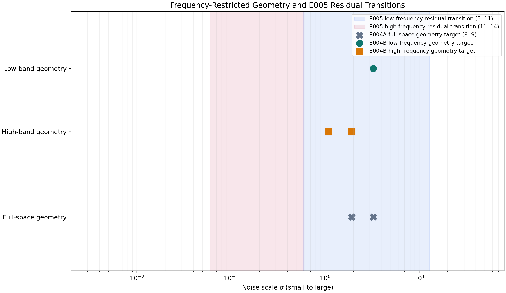

# E004B: Frequency-Restricted Geometry Results

## Status

**Completed as a paper-derived clean-room extension.**

E004B applies the E004A Gaussian-shell coverage and empirical-posterior
definitions separately inside the frozen complementary Fourier subspaces. It
does not use E005 residual curves to select either target and does not test a
model intervention.

## Frozen Setup

- CIFAR-10 canonical Python batches, hash verified.
- First 1,000 canonical training and test examples, normalized to `[-1,1]`.
- Exact 18-point EDM schedule, seed `0`, four posterior draws, eight coverage
  draws, and 500 hierarchical-bootstrap replicates.
- Channelwise centered `norm="ortho"` Fourier projections.
- Primary cutoff `r=4`; sensitivity cutoffs `r=3,5`.
- Primary classification: both 95% lower confidence bounds meet
  `q_C=q_W=0.8`.

At `r=4`, the exact real projector ranks are 147 for the low band and 2,925
for its high-band complement. Shell radii use these ranks, not the flattened
storage dimension of 3,072.

## Primary Results

The conservative lower-confidence-bound rule selects:

| Band | Target indices | Sigma values | Point estimate agrees |
| --- | --- | --- | --- |
| Low frequency | `{8}` | `{3.256821519765537}` | Yes |
| High frequency | `{9,10}` | `{1.9233398370400518, 1.088170636545279}` | Yes |

At the primary threshold crossings:

| Band | Index | Coverage (95% CI) | Maximum posterior weight (95% CI) |
| --- | ---: | --- | --- |
| Low | 8 | 0.9641 (0.9562, 0.9722) | 0.9446 (0.9364, 0.9515) |
| High | 9 | 0.9975 (0.9958, 0.9989) | 0.9048 (0.8938, 0.9141) |
| High | 10 | 0.9623 (0.9553, 0.9692) | 0.9978 (0.9962, 0.9990) |

Thus the low-band geometric target occurs one sampler index earlier, at
higher noise, while the high-band target occupies the next two indices at
lower noise. This is a descriptive subspace-geometry result. It does not show
that either band causes memorization.

Low-frequency coverage does **not** rise earlier when sigma is traversed from
small to large: the high band reaches the coverage threshold by index `10`
(`sigma=1.0882`), whereas the low band reaches it by index `8`
(`sigma=3.2568`). Equivalently, along the denoising direction from large to
small sigma, low-band coverage falls earlier and high-band coverage persists
to lower noise. Conversely, low-band posterior concentration remains above
threshold farther toward high noise: its target reaches index `8`, while the
high-band posterior first qualifies at index `9`.


## Sensitivity And Alignment

The low target remains `{8}` at `r=3,4,5`. The high target remains `{9,10}` at
`r=3,4`, but its lower-confidence-bound target narrows to `{10}` at `r=5`;
the `r=5` point-estimate target remains `{9,10}`. This confidence-interval
sensitivity is retained rather than used to revise the frozen primary cutoff.

The full-space E004A target `{8,9}` overlaps the low-band target at index `8`
and the high-band target at index `9`. Both E004B targets lie inside E005's
low-frequency residual transition `5..11`; neither overlaps E005's
high-frequency residual transition `11..14`. These are descriptive set
relationships among distinct measurements.



## Numerical Validation

All 108 metric rows are finite and all five figures are readable. For every
cutoff, the masks are binary, conjugate symmetric, exact complements, and
retain DC in the low band. The largest observed errors were:

```text
reconstruction:              9.71445146547012e-16
Parseval energy:             1.1368683772161603e-12
low/high orthogonality:      6.217248937900877e-15
posterior normalization:     1.142419492339286e-13
inverse-FFT imaginary part:  1.1013601579509182e-15
```

A second full local run produced byte-identical CSV, target, sensitivity,
validation, and PNG artifacts. The manifest differs only in runtime- and
path-dependent fields.

```text
implementation commit: 07755fac0d8ff4039669782b793db3d75c43cfeb
device:                CPU, NumPy/SciPy float64 oracle
runtime:               32.225 seconds
peak resident memory:  1059.3 MiB
config SHA-256:        ac8d1e4ac78bd1862f9f0b7e81a0f23080b01838c31775c031779ce6653c7f0a
```

## Artifacts

Compact numerical outputs are in
[`results/experiment_04b/`](../results/experiment_04b/), and the five review
figures are in [`figures/experiment_04b/`](../figures/experiment_04b/).

Reproduce locally with:

```bash
python experiments/04b_frequency_restricted_geometry.py \
  --compute \
  --dataset-root /path/to/cifar10 \
  --output-dir results/experiment_04b_reproduction \
  --figure-dir figures/experiment_04b_reproduction \
  --device cpu \
  --cutoffs 3 4 5
```

## Limitations

- This is a clean-room extension, not an original paper result.
- It is deterministic under one frozen subset, seed, and corruption set; it
  does not establish robustness across alternative subsets or seeds.
- The cutoff was selected by a disclosed single-reviewer visual decision.
- The target depends on the frozen cutoff and confidence rule; `r=5` exposes
  high-band lower-bound sensitivity.
- Frequency bands are operational subspaces, not semantic definitions of
  structure, detail, or memorization.
- E008 has not been executed.
