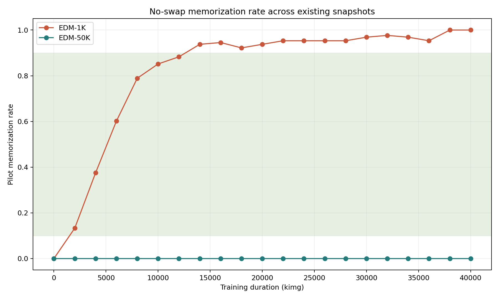
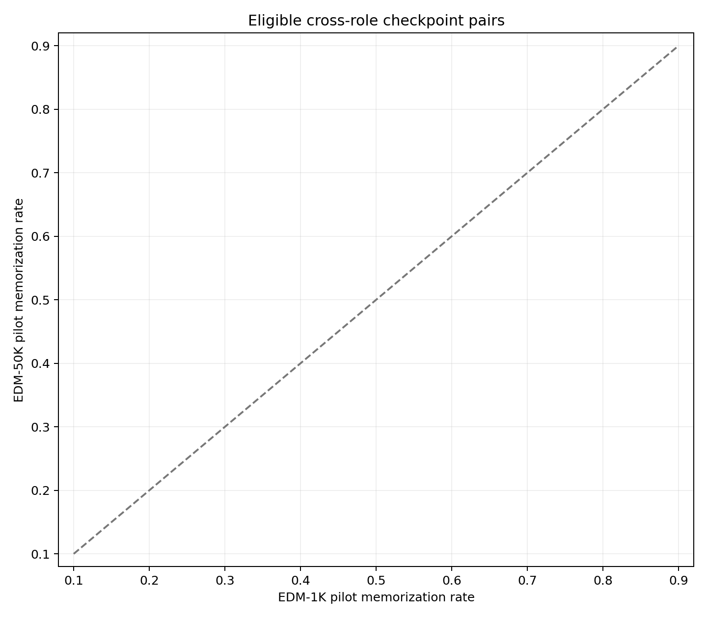

# E008 Baseline-Only Checkpoint Preflight Results

> **COMPLETE — `BLOCKED_NO_ELIGIBLE_PAIR`**
>
> This result evaluates no-swap baselines only. E008 swaps remain unexecuted.

## Exact Run

| Field | Value |
| --- | --- |
| Slurm job | `15625456` (`COMPLETED`, exit `0:0`) |
| Runtime | `00:20:03` |
| Node / GPU | `g040` / NVIDIA L40S |
| Executed commit | `b15b60e2df6191bbf1dc865ce6f2bc22e87141a6` |
| Frozen config SHA-256 | `64ae5b405ab51020eb897003f85161224508546324970f7a8e5deabe657286bd` |
| Inventory SHA-256 | `2c6316b39b9eab01e6508db7e30b363e8ed842445e97998d4c6ded33c1c2f94c` |
| Pool manifest SHA-256 | `d0b4cc35396203ab45748799cae0a1173f8fd1de8713e80fec976887ef702e9d` |
| Pilot seeds | `10000..10127` |
| Records | `42 checkpoints x 128 seeds = 5,376` |
| Failed records | `0` |
| External run directory | `/home/xggh8/data/zw-lab/e008_checkpoint_preflight` |

The run used full no-swap 18-call pure-Euler trajectories. Generated images
were evaluated against the frozen clean-room CIFAR-10 1K reference subset with
deterministic CPU `float64` nearest-neighbor arithmetic. The unchanged strict
criterion was `d1NN < d2NN / 3`.

## Frozen Decision

A checkpoint qualified only if its 128-seed memorized count was in the
inclusive interval `13..115`. Six EDM-1K checkpoints qualified. No EDM-50K
checkpoint qualified: every one of the 21 snapshots from `0` through `40,000`
kimg produced exactly `0/128` memorized samples.

Because the frozen pair-selection rule requires at least one eligible
checkpoint from each role, the formal result is:

```text
BLOCKED_NO_ELIGIBLE_PAIR
```

No threshold was relaxed, no model pair was selected, and no E008 target,
control, or donor-model condition was generated.






## All 42 Checkpoints

The confidence intervals are two-sided 95% Clopper-Pearson intervals and are
descriptive only. Eligibility is determined solely by the frozen count rule.

### EDM-1K

| Training kimg | Memorized | Rate | Eligible |
| ---: | ---: | ---: | :---: |
| 0 | 0/128 | 0.0000 | No |
| 2,000 | 17/128 | 0.1328 | Yes |
| 4,000 | 48/128 | 0.3750 | Yes |
| 6,000 | 77/128 | 0.6016 | Yes |
| 8,000 | 101/128 | 0.7891 | Yes |
| 10,000 | 109/128 | 0.8516 | Yes |
| 12,000 | 113/128 | 0.8828 | Yes |
| 14,000 | 120/128 | 0.9375 | No |
| 16,000 | 121/128 | 0.9453 | No |
| 18,000 | 118/128 | 0.9219 | No |
| 20,000 | 120/128 | 0.9375 | No |
| 22,000 | 122/128 | 0.9531 | No |
| 24,000 | 122/128 | 0.9531 | No |
| 26,000 | 122/128 | 0.9531 | No |
| 28,000 | 122/128 | 0.9531 | No |
| 30,000 | 124/128 | 0.9688 | No |
| 32,000 | 125/128 | 0.9766 | No |
| 34,000 | 124/128 | 0.9688 | No |
| 36,000 | 122/128 | 0.9531 | No |
| 38,000 | 128/128 | 1.0000 | No |
| 40,000 | 128/128 | 1.0000 | No |

### EDM-50K

All 21 checkpoints at `0, 2,000, ..., 40,000` kimg produced the same result:
`0/128`, rate `0.0000`, 95% interval `[0, 0.0284081]`, not eligible.
The complete row-level values and checkpoint identities are preserved in
[`pilot_checkpoint_summary.csv`](../results/experiment_08_preflight/pilot_checkpoint_summary.csv).

## Validation And Failure Record

- All `5,376` expected `(checkpoint, seed)` records are present and unique.
- All `42` candidates have exactly `128` successful records; failure count is
  zero.
- Pilot seeds exactly match `10000..10127`; reserved confirmatory seeds
  `0..255` were not touched.
- The output schema contains no swap fields and the manifest records
  `swap_conditions_generated=false` and `e008_executed=false`.
- The deterministic CPU evaluator was introduced only after diagnostic job
  `15623703` showed byte-identical generated samples but `3.55e-15`-scale GPU
  distance differences. The checkpoint pool, seeds, and eligibility rule were
  unchanged.

## Interpretation And Limits

The existing EDM-1K trajectory contains nondegenerate intermediate
checkpoints, but the available EDM-50K trajectory does not. This is evidence
against **training longer along this existing EDM-50K trajectory** as the next
control: all sampled checkpoints, not only the final checkpoint, are zero.
It does not prove that every 50K-data model must have zero memorization.

The preflight does not test E008's low target `{8}`, high target `{9,10}`, or
their controls. It provides no swap-effect or causal result. A separate model
design and a newly frozen baseline-only pilot are required before E008 can be
unblocked.

## Compact Artifacts

Reviewable artifacts are committed under
[`results/experiment_08_preflight/`](../results/experiment_08_preflight/) and
[`figures/experiment_08_preflight/`](../figures/experiment_08_preflight/).
The full validated output is also retained externally at the path recorded
above. No generated swap samples exist.
