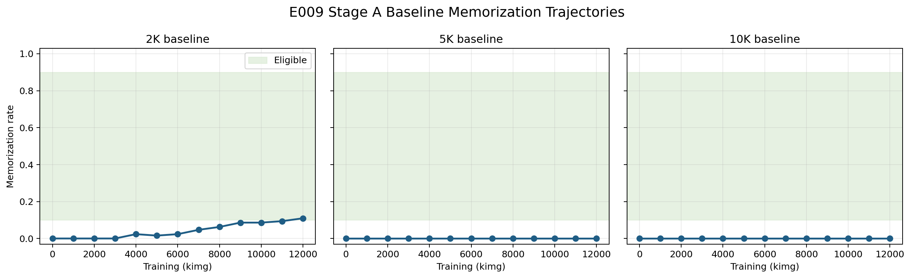

# E009 Stage A Baseline Results

Status: **STAGE A COMPLETED — `PROVISIONAL_2K_ONLY_STAGE_B_REQUIRED`**

E009 Stage A searched matched 2K, 5K, and 10K EDM trajectories for a
nonzero, nondegenerate no-swap memorization baseline. It did not execute E008
swaps and did not use confirmatory seeds.

## Exact Run Identity

| Stage | Slurm job | State | Repository commit |
| --- | --- | --- | --- |
| Training array | `15673597` | all three tasks `COMPLETED 0:0` | `d19c470bc4b547e2bad5488b30892be2814c7b12` |
| First inventory attempt | `15720430` | `FAILED 1:0` before inspection | `cbc42070776aeb848ccb6f5d6e8abaf24ef6e2e0` |
| Frozen inventory | `15720448` | `COMPLETED 0:0` | `b7dd105a0620f061b187e3f1f1e850c808450f0b` |
| Exact-rerun smoke | `15720479` | `COMPLETED 0:0` | `1d1836bce23327bb3f2c66e009125862295c1db4` |
| Full pilot array | `15720492` | all three tasks `COMPLETED 0:0` | `1d1836bce23327bb3f2c66e009125862295c1db4` |
| Summarization | `15720544` | `COMPLETED 0:0` | `1d1836bce23327bb3f2c66e009125862295c1db4` |

The evaluator used
[`experiments/09_stage_a_baseline_evaluation.py`](../experiments/09_stage_a_baseline_evaluation.py)
and the frozen config SHA-256
`6eb4edcae68d3533075401146082fdf7edb0dc40d2fc88bfd82722a342aebd32`.
The complete raw output is retained at
`/home/xggh8/data/zw-lab/e009_stage_a_baseline`.

Pilot array task jobs were `15720494` (2K, 7m30s), `15720496` (5K,
7m34s), and `15720492` (10K, 7m03s). Each used one NVIDIA L40S in the
Hellbender `gpu` partition, Python `3.13.11`, and PyTorch `2.7.1+cu118`;
the [role manifests](../results/experiment_09_stage_a/provenance/) preserve
the complete execution environment.

## Frozen Checkpoint Pool

Inventory job `15720448` accepted all 39 expected persistent checkpoints:
13 each for 2K, 5K, and 10K at `0, 1K, ..., 12K` kimg. All checkpoints were
readable unconditional EMA networks with one architecture identity.

- Inventory SHA-256:
  `0cf77c6bb3087ebc45f42eb10861516e43e38a9f72f35e24cd78b3d297ef67ad`
- Manifest SHA-256:
  `c2aa09841509c826a3288ca99a9838b2a07a001885c681a081c736b35bd12548`
- Full identities: [`candidate_checkpoint_inventory.csv`](../results/experiment_09_stage_a/candidate_checkpoint_inventory.csv)

Job `15720430` is retained as an operational failure: a path guard compared a
resolved PixStor path with its unresolved `/home` alias. It failed before
checkpoint inspection or inference and did not create the canonical output.

## Evaluation Protocol

- Checkpoints: all 39 frozen Stage A snapshots.
- Seeds: exactly `20000..20127`, 128 per checkpoint.
- Expected and observed records: `39 x 128 = 4,992`.
- Sampler: frozen 18-call pure-Euler no-swap trajectory, zero churn.
- Nearest neighbors: deterministic CPU direct-difference `float64` distances
  with stable reference-position tie breaking.
- Memorization criterion: `d1NN < d2NN / 3`.
- Eligibility: inclusive `13..115` memorized samples out of 128.
- Excluded seeds: E008 pilot `10000..10127` and confirmatory `0..255`.

Smoke job `15720479` evaluated the final checkpoint from each role with seeds
`20000,20001` twice. All six rows matched exactly across reruns, all distances
were finite, and no swap field appeared.

## Raw Results

Counts below follow kimg `0, 1K, ..., 12K`; rates are count divided by 128.
Exact Clopper-Pearson 95% intervals and checkpoint hashes are in the
[checkpoint summary](../results/experiment_09_stage_a/pilot_checkpoint_summary.csv).

| Role | Memorized counts across `0..12K` | Eligible checkpoints |
| --- | --- | --- |
| 2K | `0, 0, 0, 0, 3, 2, 3, 6, 8, 11, 11, 12, 14` | 12K only: `14/128 = 0.109375` |
| 5K | `0, 0, 0, 0, 0, 0, 0, 0, 0, 0, 0, 0, 0` | none |
| 10K | `0, 0, 0, 0, 0, 0, 0, 0, 0, 0, 0, 0, 0` | none |

The 2K 12K checkpoint has SHA-256
`93f103e2a0b6407f058aeaeae6503d9b2a171f721baa575b9dc63e05ce872e23`
and 95% interval `0.0611014..0.176701`. It is diagnostic only: the frozen
minimum larger-data role is 5K, so it cannot unlock E008.



## Decision

No 5K or 10K checkpoint passed the frozen eligibility interval. Therefore no
cross-role pair was selected and the formal outcome is:

```text
PROVISIONAL_2K_ONLY_STAGE_B_REQUIRED
```

This means Stage A found a provisional eligible 2K checkpoint but did not
produce the required larger-data baseline. E008 remains blocked and
unexecuted. Stage B was not started; it requires separate review and explicit
authorization.

## Validation

[`preflight_validation.json`](../results/experiment_09_stage_a/preflight_validation.json)
passes every frozen check: 39 accepted checkpoints, 4,992 unique explicit
records, zero failures, exact seed set, finite successful distances, no
confirmatory overlap, no swap fields, and `e008_unexecuted=true`.

## Limitations And Cross-Examination

- This result applies to one frozen training seed, three nested subsets, the
  `0..12K` trajectory, and one exploratory 128-seed pilot set.
- A zero pilot count does not prove that 5K or 10K models can never memorize;
  it shows that these checkpoints did not cross the frozen criterion here.
- The only eligible point lies at the Stage A endpoint and lower eligibility
  boundary, so extending or adding a dataset size is a new Stage B question,
  not evidence that E008 is ready.
- Shared initialization and nested subsets improve the dataset-size control
  but do not separate dataset size from all optimization-path effects.
- Confirmatory seeds remain untouched, so no confirmatory claim is made.
