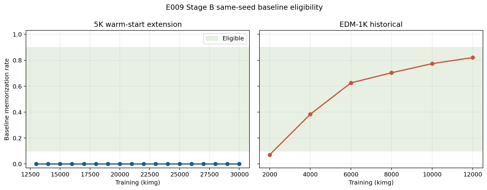

# E009 Stage B Baseline Results

Status: **COMPLETED — `BLOCKED_NO_ELIGIBLE_5K_THROUGH_30K`**

## Objective

Test whether the frozen 5K warm-start extension enters the nondegenerate
baseline memorization interval by 30K kimg, then select a same-seed EDM-1K/5K
pair only if both endpoints are eligible.

This was a baseline-only gate. It did not execute an E008 swap or use the
reserved confirmatory seeds `0..255`.

## Exact Run Identity

| Item | Value |
| --- | --- |
| Execution commit | `c0bb034a7209f4179a5222c2479c10bfe21f5740` |
| Config | `configs/e009_stage_b_evaluation.json` |
| Config SHA-256 | `4a8dcbf46af72b87ca21113795cfa42991cf6bd5053213ed65789046ba56becf` |
| Inventory job | `15826168` |
| Smoke job | `15826331` |
| Pilot array | `15826662` |
| Summary job | `15828317` |
| External output | `/home/xggh8/data/zw-lab/e009_stage_b_baseline` |
| Inventory SHA-256 | `b7b26c720c2f0e0fe1b89c2851b0f6c0ba48674e067632827da5dd6140849348` |
| Pool-manifest SHA-256 | `d64a8fc6b461f7ad0cea6e87e8fedce717e443dcec9f16b2c315c4f3beb51b44` |

The inventory contains all 18 warm-start 5K snapshots at 13K through 30K
and the six preregistered historical EDM-1K snapshots. Exact checkpoint paths
and SHA-256 identities are stored in
[`candidate_checkpoint_inventory.csv`](../results/experiment_09_stage_b/candidate_checkpoint_inventory.csv).

## Evaluation Contract

- Seeds: `20000..20127`, 128 per checkpoint.
- Records: `(18 + 6) x 128 = 3,072`.
- Sampler: frozen 18-call pure-Euler, zero churn, no swap.
- Nearest neighbors: CPU direct-difference `float64` with stable
  reference-position tie breaking.
- Criterion: `d1NN < d2NN / 3`.
- Eligibility: `13..115 / 128`, inclusive.
- Confirmatory seeds `0..255`: untouched.

The smoke evaluated two checkpoints at seeds `20000` and `20001`; two reruns
matched exactly and all finite-value, schema, seed, and no-swap checks passed.

## Results

| Role | Training kimg | Memorized | Eligible |
| --- | ---: | ---: | --- |
| EDM-1K | 2K | 9/128 | No |
| EDM-1K | 4K | 49/128 | Yes |
| EDM-1K | 6K | 80/128 | Yes |
| EDM-1K | 8K | 90/128 | Yes |
| EDM-1K | 10K | 99/128 | Yes |
| EDM-1K | 12K | 105/128 | Yes |
| EDM-5K warm-start extension | every checkpoint, 13K..30K | 0/128 | No |



All 3,072 expected checkpoint-seed records were present, unique, successful,
and finite. The failure table contains zero rows. Five EDM-1K checkpoints were
eligible, but no 5K checkpoint was eligible. The selected-pair record is
therefore null and the frozen outcome is:

```text
BLOCKED_NO_ELIGIBLE_5K_THROUGH_30K
```

## Interpretation And Limits

Matched 6,000-epoch-equivalent exposure did not make this 5K warm-start
lineage nondegenerate under the frozen evaluator. This supports stopping the
current lineage and keeping E008 blocked. It does not establish that all 5K
models, initializations, or training interventions would score zero.

No automatic extension, new training intervention, E008 swap, or confirmatory
evaluation was launched. A new training intervention requires a separately
frozen protocol.

## Durable Artifacts

Compact reviewable evidence is committed under
[`results/experiment_09_stage_b/`](../results/experiment_09_stage_b/), including
the 3,072-row table, checkpoint summary, validation, outcome, null pair record,
and per-role run manifests. Checkpoints and full training artifacts remain at
their frozen external paths and are not duplicated in Git.
