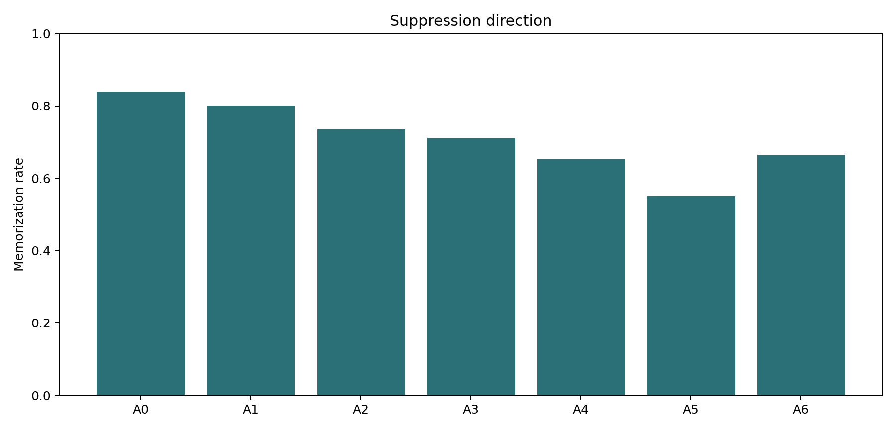
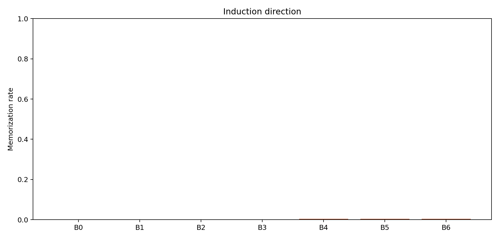
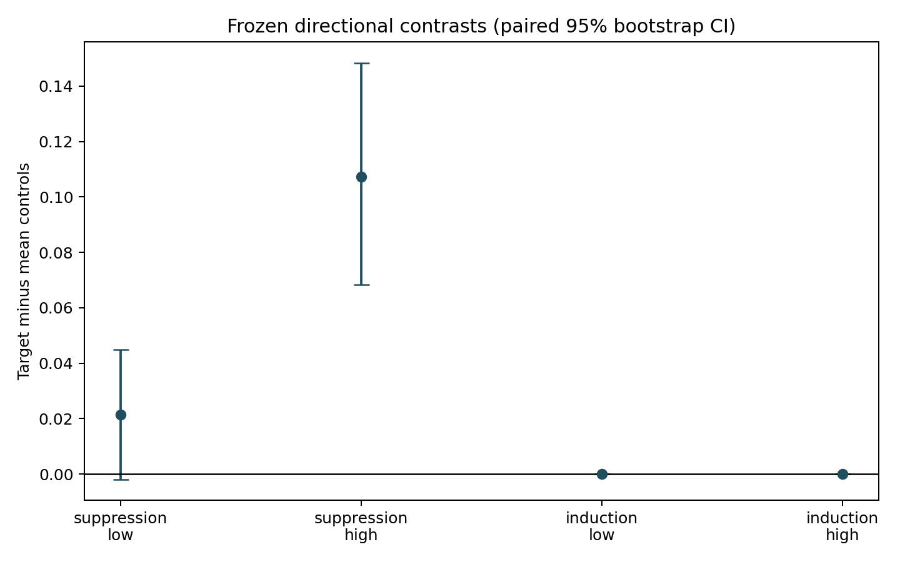
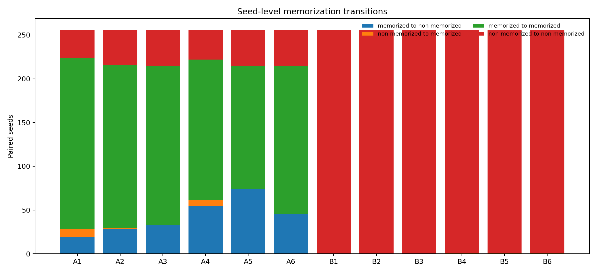

# E010: Directional Memorization-Transfer Results

Status: **COMPLETED — `HIGH_DERIVED_SUPPRESSION_SUPPORTED`**

## Objective And Scope

E010 tested directional whole-denoiser swaps between one historically
memorizing EDM-1K checkpoint and one historically generalizing EDM-50K
checkpoint. The swap intervals were selected before inference from E004B's
frequency-restricted geometry: low target `{8}` and high target `{9,10}`, each
with frozen neighboring controls.

This is an asymmetric-baseline experiment, not baseline-matched E008. It tests
whole-denoiser interventions over frequency-derived times. It does not isolate
a frequency component or establish dataset-size causality.

## Execution Identity

| Item | Value |
| --- | --- |
| Frozen implementation commit | `cb6c17208dab9ef8af80135ea6ead40cd2a439fc` |
| No-inference preflight | Slurm `15830220`, `COMPLETED`, exit `0:0` |
| 28-record smoke | Slurm `15830226`, `COMPLETED`, exit `0:0` |
| Full run | Slurm `15830229`, `COMPLETED`, exit `0:0` |
| Runtime | 14 minutes 24 seconds |
| Expected/observed records | `3,584 / 3,584` |
| Failed/nonfinite records | `0 / 0` |
| Seeds | `40000..40255` |
| Config SHA-256 | `dc8ef64dc38d9815a2054a445f3803c025d55c9a2633b4d43b8ecd8786fa23c8` |
| Model-pair manifest SHA-256 | `92746b642eeeb4c57d0bba21e5c6090e719e50390526b696f7549a1ac6979116` |
| Condition manifest SHA-256 | `aa8c9c5467fca91d36d6b56c33ef2ffe308c4d45a5093acc87034e1b6d6b5290` |
| Seed manifest SHA-256 | `0295595bd0ba7fc649ee2728d9703618b4ba28f1626e53bc419fe39e256736e2` |

The smoke covered all 14 conditions on seeds `40000,40001`; an exact rerun of
`A0` at seed `40000` matched every recorded field.

## Frozen Models And New Baselines

The memorizing model is EDM-1K at 12K kimg, SHA-256
`e5a7debafcd19191d6557f645216bfcb2e7589922396fd08130e76e3f5388b0a`,
selected prospectively as the largest eligible E008 baseline (`113/128`). On
the new E010 seeds its no-swap baseline is `215/256 = 0.83984375`.

The generalizing model is EDM-50K at 40K kimg, SHA-256
`a355ea67605dea3e2e663e94eb23416ffeb7679757088a68dc6228c03da5a92b`.
Its E010 no-swap baseline is `0/256`. This means no memorized samples were
observed under the frozen E010 seeds; it does not prove a zero population
probability.

## Condition Results

| Direction | Condition | Window | Memorized | Directional effect |
| --- | --- | --- | ---: | ---: |
| Suppression | Baseline | none | 215/256 | - |
| Suppression | Low before | `{7}` | 205/256 | 0.0390625 |
| Suppression | Low target | `{8}` | 188/256 | 0.10546875 |
| Suppression | Low after | `{9}` | 182/256 | 0.12890625 |
| Suppression | High before | `{7,8}` | 167/256 | 0.1875000 |
| Suppression | High target | `{9,10}` | 141/256 | 0.2890625 |
| Suppression | High after | `{11,12}` | 170/256 | 0.17578125 |
| Induction | Baseline | none | 0/256 | - |
| Induction | Low before | `{7}` | 0/256 | 0 |
| Induction | Low target | `{8}` | 0/256 | 0 |
| Induction | Low after | `{9}` | 0/256 | 0 |
| Induction | High before | `{7,8}` | 1/256 | 0.00390625 |
| Induction | High target | `{9,10}` | 1/256 | 0.00390625 |
| Induction | High after | `{11,12}` | 1/256 | 0.00390625 |





## Preregistered Contrasts

| Direction | Band-derived target | Target effect | Before | After | Contrast | Paired bootstrap 95% CI | Pass |
| --- | --- | ---: | ---: | ---: | ---: | --- | :---: |
| Suppression | Low | 0.105469 | 0.039062 | 0.128906 | 0.021484 | `[-0.001953, 0.044922]` | No |
| Suppression | High | 0.289062 | 0.187500 | 0.175781 | 0.107422 | `[0.068359, 0.148438]` | **Yes** |
| Induction | Low | 0 | 0 | 0 | 0 | `[0, 0]` | No |
| Induction | High | 0.003906 | 0.003906 | 0.003906 | 0 | `[0, 0]` | No |

The low suppression target did not outperform its after control and its
contrast interval included zero. The high suppression target exceeded both
controls and its paired contrast interval lay strictly above zero. Induction
did not distinguish either target from its controls.



## Paired Transitions

Relative to the memorizing baseline, the high target changed 74 seeds from
memorized to non-memorized, changed none in the opposite direction, and left
141 memorized and 41 non-memorized. Its before/after controls changed 55/45
seeds from memorized to non-memorized and 7/0 in the opposite direction.

For the generalizing recipient, all low conditions remained non-memorized.
Each high condition induced exactly one memorized seed, and it was not unique
to the target.



## Formal Conclusion

The sole preregistered supported label is:

```text
HIGH_DERIVED_SUPPRESSION_SUPPORTED
```

Under this frozen pair and seed set, replacing the whole memorizing denoiser
with the generalizing denoiser at high-frequency-derived calls `{9,10}`
suppressed the memorization criterion more than either neighboring control.
The experiment did not support low-derived suppression or either induction
test.

This is directional timing evidence for a whole-denoiser intervention. It is
not evidence that a high-frequency component itself causes memorization. The
networks differ in training-data size and training trajectory, so the result
also cannot be attributed to dataset size alone.

## Validation And Artifacts

All 3,584 condition/seed keys are unique and complete; every distance is
finite; no traceback, CUDA, quota, no-space, or I/O error occurred. Bootstrap
uses 100,000 paired seed resamples with RNG seed 0. Eight figures decode
successfully.

Compact artifacts are committed under
[`results/experiment_10/`](../results/experiment_10/) and
[`figures/experiment_10/`](../figures/experiment_10/). The full raw run remains
external at:

```text
/home/xggh8/data/zw-lab/e010_directional_memorization_transfer
```

The external per-sample CSV has SHA-256
`20445c2d09da072ce34a9e0ac1763223a7b73fde23ac0b56811b4b9e5f5b532c`
and 3,584 rows. The generated-sample NPZ has SHA-256
`d766900963648213bbaed982178779a802a4bf473fbecffe1dd9580ae910f584`
and size 46,513,415 bytes. Neither is committed.

## Limitations

- The model baselines are intentionally asymmetric and not matched.
- The generalizing baseline is at the observed floor, limiting induction
  sensitivity under this pair and criterion.
- E004B's low/high subspaces differ strongly in rank and other geometry.
- E010 swaps the whole denoiser, not a Fourier component.
- The result uses one model pair, one frozen 256-seed set, one sampler, and a
  strict pixel-space nearest-neighbor criterion.
- The model pair differs in data size and training trajectory; dataset-size
  causality is not identified.
- E008 remains blocked and unexecuted; E010 does not satisfy its matched-pair
  gate.
